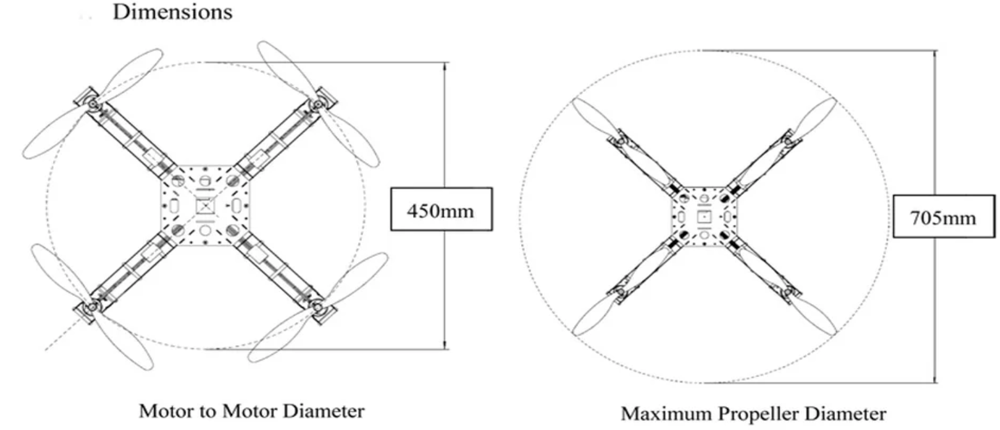
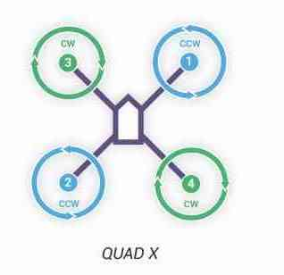

Quadcopter Assembly
=====

This is a tutorial for RISC lab boot camp. Please find all the components in RISC shoebox and toolbox prepared in Area C’s shelf.

Basic principles
-----

Feel free to place the components anywhere on the frame but take care of wires. Refer to quadcopters we already have in the lab. Carefully choose zipties, shrinking tubes, double sided tapes or soldering for different situations. Generally, for fixing motor wires we use zipties. Shrinking tubes are for permanent connection between wires when soldering.

Preliminaries
------

This tutorial assumes you have the following skills:

* `ROS Basics <1-1.html>`_ or `ETHZ Online Course <http://www.rsl.ethz.ch/education-students/lectures/ros.html>`_. And refer to `solutions to exercises <https://github.com/luym11/ros_practise>`_ on Github.

* Soldering, if not, please refer to basic skill `video <https://www.youtube.com/watch?v=BLfXXRfRIzY>`_.

* Basic knowledge about LiPo batteries. Answer the following questions. You may read this `article <https://rogershobbycenter.com/lipoguide/>`_. 

  - What do 3s, 4s mean?
  - What does 20c mean?
  - What does 1400mAh mean?
  - What are the parameters of your battery?
  - How to charge LiPo battery? How to measure it voltage using meter?
  - What’s the minimum voltage to use a LiPo on the quad

* Basic knowledge about motors. Answer the following questions. You may refer to this `article <https://www.dronetrest.com/t/brushless-motors-how-they-work-and-what-the-numbers-mean/564>`_.

  + Different types of motors. We are using brushless motor for quads.
  + What does KV2200 means? What will be changed if KV number grows?
  + What are the parameters of your motors?

Hardware assembly
-----

Introduction
^^^^^

You will need

* Quadcopter frame. 250 frame will be a good start. 250 means the motor to motor diameter, as shown below.

* Power distribution board to distribute power from a battery to 4 ESCs.

.. image:: ../_static/distro-power.jpg
   :scale: 50 %
   :align: center

* Flight Controller. Use any flight controller available in the lab. Just make sure you have compatible power modules, receivers, GPS, and other additional modules. The documentations for each board are available at `here <https://docs.px4.io/en/flight_controller/pixhawk_series.html>`_.

* Brushless motors and propellers. For mini quad pilots, 3-blade (or tri-blade) propellers are equally popular as the two blades, they are commonly used in both racing and free-style flying. Some people prefer triblades because it has more grip in the air. Basically, by adding more blade it’s effectively adding more surface area, and therefore it generates more thrust in the expense of higher current draw and more drag. 

.. note:: 
  
  There are 2 types of format that manufacturers use.

  L x P x B or LLPP x B where L- length, P – pitch, B – number of blades.

  For example 6×4.5 (also known as 6045) propellers are 6 inch long and has a pitch of 4.5 inch. Another example, 5x4x3 (sometimes 5040×3) is a 3-blade 5″ propeller that has a pitch of 4 inch. “BN” indicates Bullnose props.

  Sometimes you might see **R** or **C** after the size numbers, such as 5x3R. **R** indicates the rotation of the propeller, which stands for “reversed”. It should be mounted on a motor that spins clockwise. **C** is the opposite, should be used with motors that spins counter-clockwise.

* Electronic speed controller (ESC) controls and regualates the speed of an electric brushless motor. All ESCs comes with a rating. The Turnigy Multistar ESC shown below has a rating of 10A, meaning it can draw a maximum continuous current of 10A. Anything higher than 10A will eventually burn or damage the ESC. 

.. image:: ../_static/esc.jpg
   :scale: 50 %
   :align: center

.. note:: 

  Drawing 10A for a long time (~10mins) will heat up the ESC and damage it as well. Always use a higher rating ESC for your setup. E.g. If your motor draws 10A (at full throttle), use either a 12A or a 15A. If the 12A and the 15A ESC weight approximately the same, choose the 15A. A higher rating ESC will prevent overheating. To handle more power, a high rating ESC will be required. As the rating goes up, the weight, size and cost of the ESC go up as well. Always consider how much power you will need by looking up your motor specification (Max current motor drawn). 

* Remote control system. A remote control (RC) radio system is required if you want to manually control your vehicle. In addition to the transmitter/receiver pairs being compatible, the receiver must also be compatible with PX4 and the flight controller hardware. Spektrum and DSM receivers must connect to a SPKT/DSM input. PPM-Sum and S.BUS receivers must connect directly to the RC ground, power and signal pins (typically labeled **RC** or **RCIN**)

The most popular form of remote control unit (transmitter) for UAVs is shown below. It has separate control sticks for controlling roll/pitch and for throttle/yaw as shown

.. image:: ../_static/rc_basic_commands.png
   :scale: 30 %
   :align: center

* UBEC (Universal Battery eliminator circuit) to convert voltage to power Odroid (in case you are using it). A BEC is basically a step down voltage regulator. It will take your main battery voltage (e.g. 11.1 Volts) and reduce it down to ~5 Volts to safely power your Odroid and other electronics.

.. image:: ../_static/ubec.jpg
   :scale: 40 %
   :align: center

* Power module. It is the best way to provide power for flight controller unit. It has voltage and current sensors that allows autopilot to estimate remaining battery charge precisely. Usually it comes with every autopilot controller as a default kit. Check official documentations to match right power module to a selected flight controller.

.. image:: ../_static/power_module.jpg
   :scale: 60 %
   :align: center

* LiPo battery. Assuming you know what is the balancer, cell count and voltage, capacity and C-rating.

Assembly process
^^^^^

* Assemble the frame. Attach the power distribution board to it.

* Mount the motors to the frame. Mind CW and CCW directions. They should be mounted as follows. We usually use **X** configuration.

.. important::

	Do not install propellers now.

* Connect ESCs to motors and plug ESCs to power distribution board. As for now, connect motors to ESCs arbitrary, later you will set them properly by switching any two wires.

* Install power module on the frame. One end should be plugged to power distribution board and the other end to the battery. DON’T plug it to the battery for now.

* Install flight controller on the frame. Take a look at your flight controller and make sure the arrow is pointing to the front between motor 1 and 3. Also, use double sided 

* Plug cable from power module to ``POWER`` port of your flight controller.

* Plug buzzer and switch to their corresponding ports on flight controller.

* Connect each of your ESCs servo cables to the corresponding **MAIN OUT** output, eg. motor 1 to MAIN OUT port 1.

`this part need to be explained in a better way`

* If you are using RC receiver with autobind, then do this....

* Bind the RC receiver with an RC (Use Spectrum RC because those receivers in the shoebox should be used with them) and install them. We have one special binder to do that and it’s placed in the toolbox beside RISC shoeboxes. You will also find RCs there. The binding process is as follows:

receivers connect to the flight controller using the port appropriate to their supported protocol:

  + Insert the jumper wire to Pixhawk like a motor, we just need to power it through this way
  + Insert the signal wire to another end of the RC receiver
  + Plug the battery (Find in the toolbox) to power wire
  + Turn on the RC while pressing the left up button (marked as Trainer Bind), wait until the RC receiver is lighting statically
  + Remove the RC from binder, use its own signal wire to connect with Pixhawk via port SPKT/DSM

* Plug the battery and check 4 ESCs has static green LED lighted up and BEC has red. Buzzer will produce sound in the beginning and remain silent. Unplug the battery.

* For this stage there’s no need to install Odroid. This will be illustrated later.

Calibration process
-----

* Download ``QGroundControl`` on your PC and open it.

* Connect Pixhawk with your PC via USB. You should see it connected in the software.

* In ``Airframe tab`` choose proper airframe according to the one you have.

* In ``Radio tab`` click ``Calibrate`` button and follow instructions.

* In ``Sensors tab`` calibrate all the sensors following the instructions. After calibration they will be green. Note that there will be a progress bar while calibrationg each sensor, which indicates your progress. After finishing calibration of one sensor, wait until it reaches the end and then press ``OK`` and move on to the next.

* In ``Flight Modes tab``

  - Modes: Channel 6 (marked as ``FLAP/GYRO``)
  - Mode 1: Position
  - Mode 4: Altitude
  - Mode 6: Manual
  - Kill switch: Channel 5 (GEAR MIX)
  - If you set them right, when you are picking those channels your action will be reported in ``QGroundControl``

* In ``Power tab`` write the parameters of your battery (Number of cells, Full/ Empty voltages)

  - Click ``Calculate`` beside ``Voltage divider`` and type in measured voltage (can be measured using multimeter in the toolbox), click ``Calculate``
  - Click ``Calibrate`` to calibrate ESCs

* In ``Parameters tab`` tune the parameters, general process is tuning ``P`` first then ``I`` and ``D`` at last for yaw, pitch and roll. Hold the quad in your hand to feel if it’s well tuned. You may follow this `guide <https://docs.px4.io/en/advanced_config/pid_tuning_guide_multicopter.html>`_.

Flying
------

* Unplug the quadcopter from PC
* Press Safety switch on Pixhawk until it blinks faster
* Arm (Hold throttle at minimum and rudder to the right for 2 seconds) the quad using RC and check if the motors are spinning in correct directions as the picture by slightly touching them. If not, change any two wires of that motor. Disarm (Opposite of arm)
* Install propellers. Note that there are CW and CCW propellers as well.
* **OPTIONAL.** If still want to connect the quad to ``QGroundControl``, install telemetry
* Manual kill switch off. Select manual mode.
* Check battery condition. **Always keep this in mind.**
* Put the quad in the cage and arm again. Slowly add throttle while keep it in the middle of the cage by controlling pitch and yaw.
* If it flies, you can do more manoeuvres

Troubleshooting
------

* Motors not rotating while armed and rotates with higher throttle

  - Check PWM min/max in parameters and make sure it’s associated with ESCs

Contributors
-----

Main contributor is `Yimeng Lu <https://github.com/luym11>`_.