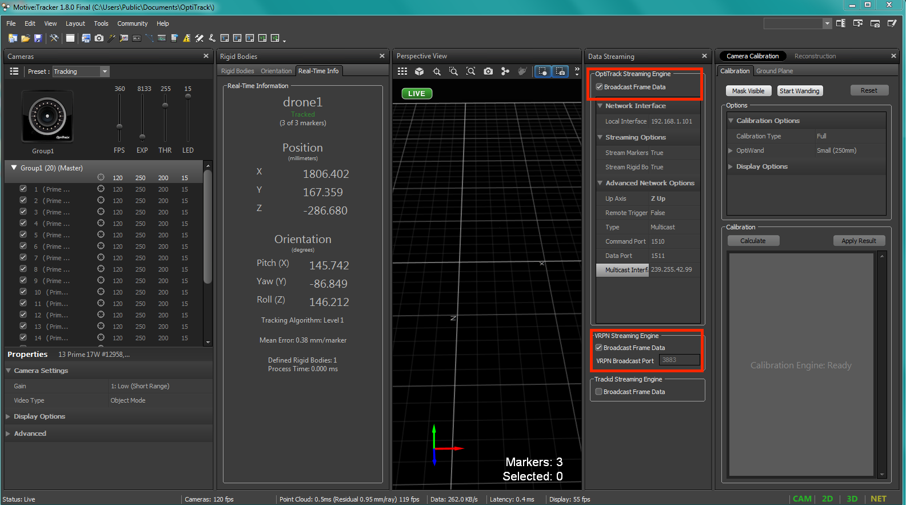

OptiTrack Interface to ROS
=====

Intro
----

This tutorial will show you how to get OptiTrack information (position and orientation) of a rigid body that is defined in Motive (motion capture software) to a ROS node. This allows you to get localization data on your robot in an indoor environment.

Required Hardware
----

* Optitrack system
* WiFi router (5GHz recommended)
* A linux computer e.g. normal PC or onboard embedded computer like ODROID XU4. This will be connected to the router either via ethernet cable or WiFi connection.

Required Software
-----

* Motive. This is the motion capture software that runs on the mocap machine. It allows you to calibrate your optitrack system, stream tracking information to external entities.

* ROS *Kinetic* installed on your Linux computer. If you will use ODROID XU4, flash it with Ubuntu 16 and ROS Kinetic. Ready Ubuntu images with ROS Kinetic for your eyes are available. ([ubuntu16_minimal_image](https://www.dropbox.com/s/bllrihqe9k8rtn9/ubuntu16_minimal_ros_kinetic_mavros.img?dl=0), [full_ubuntu16](https://www.dropbox.com/s/gybc65tbct4d68b/ubuntu16_full_ros_kinetic.img?dl=0))

You can use `Etcher <https://etcher.io/>`_ to flash your ODROID eMMC card with your Ubuntu ``.img`` file.

Install Mocap ROS package (works with Optitrack and VICON) to receive the tracking data from your mocap system. The package page is called `vrpn_client_ros <http://wiki.ros.org/vrpn_client_ros>`_. To install the package use the following command (assuming ROS Kinetic). **If you are using the minimal Ubuntu image provided above, you don't need to install this package as it's already included**

.. code-block:: bash
	sudo apt-get install ros-kinetic-vrpn-client-ros -y

.. note::

	It is recommended that you use *static IP* for your linux machine e.g. ODROID or PC

.. warning::
	
	In Motive, make sure you are streaming VRPN data by going to View > Streaming > Check the box in front of Stream VRPN Data. Lastly, make sure you either turn off the Windows Firewall or create outbound rules for the VRPN port (recommended).

Streaming MOCAP Data
-----

Now, you should be set to get data from mocap to your ROS.

1. Make sure that you installed ``vrpn_client_ros`` package. *All required packages are already included in the minimal ubuntu image referenced above*
2. If you are streaming data to an ODROID which is connected to a flight controller, make sure that you have ``mavros`` installed. See **next tutorial** to know how feed mocap data to Pixhawk that is connected to ODROID.
3. Make sure that you configured your Motive as mentioned above
4. Connect the PC that runs Motive to your router with an ethernet cable
5. Note down the IP address given to the Motive PC, let's call it ``motive_ip``
6. Create a rigid body in Motive and give it a proper name e.g. ``uav1``

.. error::

	If your rigid body has white spaces in its name e.g. ``robot 1``, the ROS mocap node will not receive it and will give errors

7. In your ROS machine, where you want to get tracking data, run the ``vrpn_client_ros`` node as follows

.. code-block:: bash

	roslaunch vrpn_client_ros sample.launch server:=<motive_ip>

8. Now you should be able to receive mocap data under topics that look like ``/vrpn_client_node/<rigid_body_name>/pose``