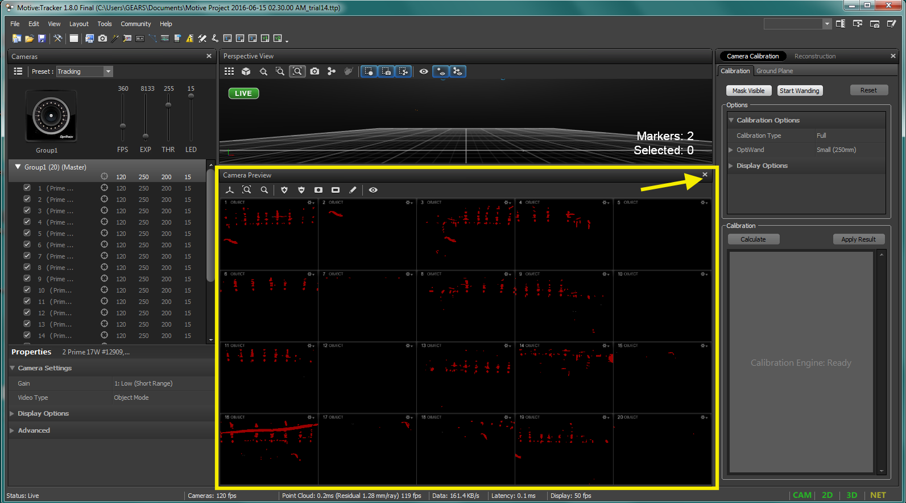

MATLAB Pixhawk Communication
=====

In this demo you will learn two things

* Sending high-level commands  from MATLAB to Pixhawk, using ``MATMAV``

* Getting live stream of images into MATLAB from ODROID which is mounted on a quadcopter.

.. image:: ../_static/demo1.png
   :scale: 50 %
   :align: center

As you can see from the previous figure, there are 4 main components to setup.

* Motion capture system.

* Quadcopter with Pixhawk flight controller.

* ODROID: embedded Linux computer.

* MATLAB enviornment.

Motion capture setup
----

Motion capture (or Mocap in short) is used to provide accurate positions and orientations in an indoor environment. The mocap setup we have in the lab is from *Optitrack* company. You can think of it as GPS system for indoor environment. 

Mocap mainly consists of cameras, network switches, and a PC with a special software. Cameras capture images which contain special *reflective markers*. Those markers are used to track objects (rigid bodies) they are attached to. Then, images from all cameras are transmitted to the PC software (called *Motive*) through the network switches, in order to do further image processing. 

*Motive* extracts useful information about captured rigid bodies such as position and orientation. Such information can be further transmitted through network to other PCs for further usage. Rigid bodies are defined by at least 3 reflective markers that are rigidly mounted on the object of interest.

For this tutorial, it is assumed that the Mocap is already calibrated.

What we need in this tutorial is to

* Open *Motive* project

* Define rigid bodies

* Configure streaming parameters in Motive

* Use the Streaming Application to send mocap info to Pixhawk

**Follow the following steps in order.**

* Open *Motive* software, and choose ``Open Existing Project``. Choose a recent project that represents the latest calibration settings.

.. image:: ../_static/startup-screen.PNG
   :scale: 50 %
   :align: center

.. image:: ../_static/choose-project.PNG
   :scale: 50 %
   :align: center

* Close the ``Camera Preview`` view, and leave the ``Perspective View`` view for 3D viewing of objects.

* Place the object in the cage (e.g. quadcopter) with mounted markers (minimum 3 markers).
* Select markers in the ``Perspective View`` and create a rigid body

.. image:: ../_static/createRigidbody.png
   :scale: 50 %
   :align: center

* You can know your rigid body number from the ``Rigid Body``, after you select the rigid body in the ``Perspective View``.

* Now, activate streaming over network as follows

.. image:: ../_static/motiveStreamTab.PNG
   :scale: 50 %
   :align: center

* Connect the wireless serial module to the Mocap PC (e.g. XBee)
* Open Mocap streaming App.

.. image:: ../_static/mocapstream.PNG
   :scale: 50 %
   :align: center

* Select the proper *Vehicle ID*

* In the ``Serial Connection`` tab, select the proper serial port of the communication module from the ``Port Name`` drop menu. Set the ``Baud Rate`` to *57600*. Finally, click the ``Connect`` button. If the connection is successful, it will show a status message in the ``Port Status`` field.

* In the ``Mocap Connection`` tab, leave the ``Mocap IP`` and ``Client IP`` to the defaults IPs (``127.0.0.1``). Hit the ``Connect`` button.

* If the connection is successful, you should see the defined rigid bodies in the ``Received Bodies`` list box.

* Select the one corresponds to the quadcopter. Then, check the ``stream to Mav`` checkbox.

* Now, your quad should be getting its position and orientation feedback from the Mocap system.

Quadcopter setup
-----

This tutorial assumes that the quadcopter is setup and equipped with a calibrated Pixhawk (or Pixracer) flight controller.

In this Demo, the quadcopter is assumed to have an ODROID on-board, two serial communication modules (e.g. XBee). One for the Mocap connection, and the other for MATLAB connection.

ODROID setup
------

In this Demo, ODROID is used to capture real-time images and stream them over WiFi network to a MATLAB session. The streaming application is assumed to be installed on ODROID and ready to be used. Also, the ODROID is assumed to be setup to connect to a local WiFi network.

Check `this guide <https://github.com/mzahana/Image_Live_Stream>`_ to see how to install the streaming app on ODROID.

To run the application, follow the following steps in order

* Connect a compatible camera to ODROID
* Connect a compatible WiFi module to ODROID (use the ODROID WiFi adapter)
* Power on the ODROID
* From your laptop (which is connected to the same local WiFi network as the ODROID), open a terminal and remotely log-in to ODROID

.. code-block:: bash

	ssh odroid@192.168.1.113
	password: odroid

``odroid`` is the user account name. ``192.168.1.113`` is the ODROID's IP address.

* Navigate to the app folder and run it

.. code-block:: bash

	cd ~/Desktop/imgstream/Image_Live_Stream/opencv_stream/stream_cpp
	./sender 192.168.1.112 10000

``192.168.1.112`` is your machine's IP address. ``10000`` is the port that is going to be opened in your MATLAB. You can choose another port, but make sure it matches the one used in your MATLAB.

* Now, the ODROID is sending images to the specified IP and port.

MATLAB setup
------

In this Demo, MATLAB is used to 

* Communicate with Pixhawk (or Pixracer) in order to send high-level commands. For example, position set-points, velocity set-points, or acceleration set-points. It can also receive feedback information from Pixhawk.

* Receive live-stream of images from ODROID.

.. warning::
	
	You need to use the MATLAB files associated with this Demo. Please ask for your free copy.

We are going to use two main MATLAB classes in this Demo. One is called ``MatMav``, and the other is called ``ImgStream``.

``MatMav`` is a MATLAB class that is used to communicate with Pixhawk. ``ImgStream`` is a MATLAB class that is use to receive live image stream from ODROID (or any Linux computer) over network.

Before you use the MATLAB files associated with this demo, you should setup your environment properly.

.. warning::
	
	Before you use the MATLAB files associated with this demo, you should setup your environment properly. Namely, you need to associate your MATLAB with a C/C++ compiler, and install OpenCV.

Please follow the OpenCV installation as follows,

* For `Mac OS <https://www.youtube.com/watch?v=U49CVY8yOxw>`_.
* For `Windows <https://www.youtube.com/watch?v=EcFtefHEEII>`_.

Google how to associate your MATLAB with a compiler.

* Download the MATLAB folder associated with this Demo.
* Open MATLAB and navigate to that folder.
* Run the ``setup.m`` file.

If all goes well, you should get the message ``Setup is done``. Now, you are ready to proceed with the experiment which is implemented in the ``Demo1.m`` MATLAB file.

* Check the ``Demo1.m`` file to get familiar with ``MatMav`` and ``ImgStream`` classes.