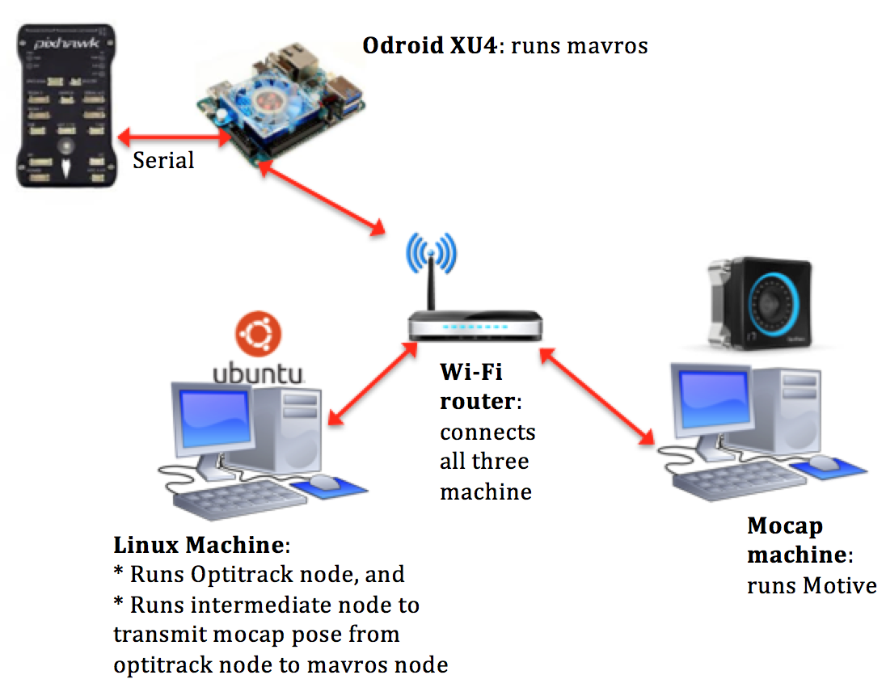
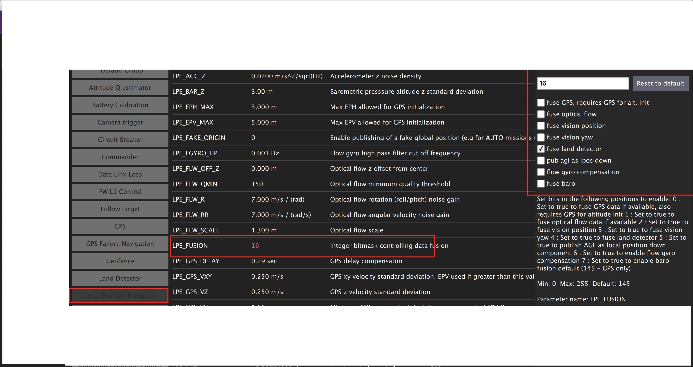

Indoor flying
*****

System Architecture
=========

In order to start flying the quadcopter indoor, we need the position and orientation feedback for this.

This section will guide you how to use OptiTrack Motion Capture System, how to stream position and orientation data to ROS, and feed it to your flight controller. Finally you will be able to fly your drone inside the arena.

.. image:: ../_static/sys_arch2.png
   :scale: 30 %
   :align: center

The overall systems has following main elements:

* OptiTrack Motion Capture System
* Object to be tracker, eg. quadcopter, ground vehicles.
* Controller

Let's discuss each element in details

Motion capture system
-----

OptiTrack motion capture system (Mocap hereinafter) works as follows. The overhead cameras send out pulsed infrared light using the attached infrared LEDs, which will then be reflected by markers on the object and detected by the OptiTrack cameras. Knowing the position of those markers in perspective of several cameras, the actual 3D position of the markers in the room can be calculated using triangulation. Simply Mocap provides high precision indoor local position and orientation estimation. Position is meters and orientation is in quaternion, which can be converted Euler angles in radians. In RISC lab we use twenty **Prime17w** cameras that are installed in the flying arena.
    
All cameras are connected to a single Mocap PC through network switches. Motive Optical motion capture software is installed on this PC.
  
Controller
-----

Controllers are PCs or single board computer (SBC) which are used to control the objects in the flying arena. When a PC is used to control an object, this referred as **OFFBOARD** control. Also a controller can be a flight controller that runs an autopilot firmware to control a vehicle (e.g. quadcopter).

A companion computer is referred to SBC that is connected to a flight controller. Usually, SBC is used to perform more sophisticated/high computations that the flight controller can not. In other words, the flight controller is designed for low-level tasks, e.g. attitude control, motor driving, sensor data acquisition. However, the companion computer is used for high-level-control e.g. path planning, optimization.  

Motion Capture Setup: OptiTrack
=========

Camera calibration
-----

Make sure that you remove any markers from the captured area and Area-C before performing calibration.

Make sure that you use clean markers on the Wanding stick.

The calibration involves three main steps

* Sample collections using the Wanding stick
* Ground setting using the L-shape tool
* Ground refinement

Follow `this guide <http://wiki.optitrack.com/index.php?title=Calibration>`_ in order to perform the calibration.

.. note::

	It is recommended to perform camera calibration on a weekly basis, or every couple of weeks.

Calibration video:

.. raw:: html
	
	<iframe width="560" height="315" src="https://www.youtube.com/embed/cNZaFEghTBU?rel=0" frameborder="0" allow="autoplay; encrypted-media" allowfullscreen></iframe>

Motive setup
-----

In this section, we mainly want to learn how to 

* Create rigid bodies that represent objects to be tracked (e.g. quadcopter)
* Make an appropriate marker setup

Make sure that you have clean markers. Markers should not be placed in symmetric shape. Markers should not be close to each other.

Read `this guide <http://wiki.optitrack.com/index.php?title=Markers>`_ for detailed markers setup.

Follow `this guide <http://wiki.optitrack.com/index.php?title=Rigid_Body_Tracking>`_ to create rigid bodies.

.. _optitrack-interface:

OptiTrack Interface to ROS
=====

Getting positions of objects in the observable OptiTrack space to ROS works as follows.

Required Hardware
----

* Mocap machine. Runs Motive Motion Capture Software.
* Optitrack Motion Capture System
* WiFi router (5GHz recommended)
* A Linux based computer, normal PC or on-board embedded computer like ODROID XU4 will work. The Linux computer should be connected to the router either via Ethernet cable or WiFi connection.

Required Software
-----

* Motive. It allows you to calibrate your OptiTrack system, stream tracking information to external entities.

* ROS Kinetic installed on your Linux computer.

* The package `vrpn_client_ros <http://wiki.ros.org/vrpn_client_ros>`_ for ROS to receive the tracking data from the Mocap computer.

Installation
-----

Method 1. PC
^^^^^

Install `vrpn_client_ros <http://wiki.ros.org/vrpn_client_ros>`_ using following command.

.. code-block:: bash

	sudo apt-get install ros-kinetic-vrpn-client-ros -y

Configure your IP address to be manual with the following values:

.. code-block:: bash

	IP: 192.168.0.xxx (The *xxx* value shouldn't conflict with existing IP addresses)
	Subnet Mask: 255.255.255.0
	Gateway: 192.168.0.1
	DNS Server: 8.8.8.8

Check `this video <https://www.youtube.com/watch?v=o9fJWDoX4nE>`_ to set static IP on Ubuntu.

Method 2. Odroid XU4
^^^^^

Download `Ubuntu 16 with ROS Kinetic minimal <https://www.dropbox.com/s/bllrihqe9k8rtn9/ubuntu16_minimal_ros_kinetic_mavros.img?dl=0>`_ or `Ubuntu 16 Full with GUI <https://www.dropbox.com/s/gybc65tbct4d68b/ubuntu16_full_ros_kinetic.img?dl=0>`_. It's highly recommended to use minimal image.

Flash image with `Etcher <https://etcher.io/>`_ to `ODROID XU4 eMMC <http://www.hardkernel.com/main/products/prdt_info.php?g_code=G145628174287>`_.

.. important:: 

	Make sure that you expand your eMMC card after you flash a new image in order to use the full space of the eMMC card. Use Gparted Partition Editor on Linux to merge unallocated space with flashed space.

No need to install `vrpn_client_ros <http://wiki.ros.org/vrpn_client_ros>`_ package as it's already included. Now connect your ODROID XU4 to monitor using HDMI cable. You will also need a keyboard.

After powering the ODROID you will prompt to enter username and password. It's all ``odroid``. Plug the `WiFi Module 4 <http://www.hardkernel.com/main/products/prdt_info.php?g_code=G141630348024>`_ to the ODROID's USB port. 

Check the WiFi card number by typing following command

.. code-block:: bash
	
	ifconfig -a

To set a static IP address open ``/etc/network/interfaces`` file for editing by following command

.. code-block:: bash
	
	sudo nano /etc/network/interfaces

Modify the file so it matches your WiFi network. It should look similar to this.

.. code-block:: bash

	auto wlan0 # The following will auto-start connection after boot
	allow-hotplug wlan0 # wlan0 WiFi card number
	iface wlan0 inet static
	address 192.168.0.xxx # Choose a static IP, usually you change the last number only for different devices
	netmask 255.255.255.0
	broadcast 192.168.0.255
	gateway 192.168.0.1 # Your router IP address
	dns-nameservers 8.8.8.8
	wpa-ssid "RISC-AreaC" # WiFi name
	wpa-psk "risc3720" # WiFi password

Mocap computer settings
^^^^^

In Motive, choose **View > Data Streaming** from menu bar. Check the boxes ``Broadcast Frame Data`` in **OptiTrack Streaming Engine** and **VRPN Streaming Engine** sections. Create a rigid body by selecting markers of interest. Refer to picture below.

.. image:: ../_static/capture1.png
   :scale: 50 %
   :align: center

Make sure you either turn off the Windows Firewall or create outbound rules for the VRPN port (recommended).

Right click on the body created, choose **Properties** and rename it such that there is no spaces in the name.

.. image:: ../_static/capture2.png
   :scale: 50 %
   :align: center

.. _stream-mocap-data:

Streaming MOCAP Data (try with both PC and Odroid)
-----

Check the IP address assigned to the Mocap machine, in our case it's **192.168.0.101**

In your ROS machine (PC or ODROID), where you want to get tracking data, run the ``vrpn_client_ros`` node as follows

.. code-block:: bash

	roslaunch vrpn_client_ros sample.launch server:=192.168.0.101

Now you should be able to receive Mocap data under topic ``/vrpn_client_node/<rigid_body_name>/pose``.

Open new terminal (**CTRL + ALT + F2** on ODROID XU4) and try following command

.. code-block:: bash

	rostopic echo vrpn_client_node/<rigid_body_name>/pose

You should get similar to this. More information on message type `here <http://docs.ros.org/api/geometry_msgs/html/msg/PoseStamped.html>`_.

.. image:: ../_static/capture4.png
   :scale: 60 %
   :align: center

Feeding MOCAP data to Pixhawk
=====

Intro
----

This tutorial shows you how to feed MOCAP data to Pixhawk that is connected to an ODROID, or an on-board linux computer. This will allow Pixhawk to have indoor position and heading information for position stabilization.

Hardware Requirements
-----

* Pixhawk or similar controller that runs PX4 firmware
* ODROID (we will assume XU4)
* Serial connection, to connect ODROID to Pixhawk. You can use USB/FTDI cable. If you are using **Pixhawk 2**, then connect the serial cable to ``TELEM2`` port. If you are using **MindPX** flight controller, just use a USB to micro-USB cable and connect it to **USB/OBC** port.
* OptiTrack PC
* WiFi router (5GHz is recommended)

Software Requirements
------

* Linux Ubuntu 16 installed on ODROID XU4. A minimal image is recommended for faster executions.

* ROS `Kinetic <http://wiki.ros.org/kinetic/Installation/Ubuntu>`_ installed on ODROID XU4. The above image already includes this

* ``MAVROS`` package: `Binary installation <https://github.com/mavlink/mavros/blob/master/mavros/README.md#binary-installation-deb>`_. Again, the above image includes this

* Install ``vrpn_client_ros`` `package <http://wiki.ros.org/vrpn_client_ros>`_. You can use the following command to install the package (assuming **ROS Kinetic** is used).

.. code-block:: bash

	sudo apt-get install ros-kinetic-vrpn-client-ros -y

Again, this is included in the provided image

Now, you need to set your flight controller firmware PX4, to accept mocap data. PX4 has two state estimators, ``EKF2`` (default) an extended Kalman filter, and ``LPE``.

``LPE`` estimator supports mocap data directly. ``EKF2`` (recommended for this tutorial), however, (at the time of writing this tutorial) does not support directly. Instead, it can accept mocap data as vision-based data. We will explain how to setup both estimator to use mocap data.

Setting EKF2 Estimator for MOCAP Fusion
-----

First choose ``EKF2`` as your estimator from the ``System`` tab

.. image:: ../_static/ekf2_est.png
   :scale: 50 %
   :align: center

Also make sure the you set the baudrate correctly ``SYS_COMPANION``

In the ``EKF2`` parameters tab, set ``EKF2_AID_MASK`` to **not** use GPS, and use vision position and yaw.

.. image:: ../_static/ekf2_mask.png
   :scale: 50 %
   :align: center

There are some delay parameters that need to set properly, because they directly affect the EKF estimation. For more information read `this wiki <https://dev.px4.io/en/tutorials/tuning_the_ecl_ekf.html>`_

.. image:: ../_static/ekf2_delay.png
   :scale: 50 %
   :align: center

Choose the height mode to be vision

.. image:: ../_static/ekf2_hight_mode.png
   :scale: 50 %
   :align: center

Set the position of the center of the markers (that define the rigid body in the mocap system) with respect to the center of the flight controller. +x points forward, +y right, +z down

.. image:: ../_static/marker_pos.png
   :scale: 50 %
   :align: center

Setting LPE Estimator for MOCAP Fusion
------

You will need to set some parameters on Pixhawk as follows

Select ``LPE`` as your estimator. You can change that from the ``System`` tab in ``QGroundControl``.

You will also need to use the highest baud rate for the serial connection. See below picture.

.. image:: ../_static/systems_tab.png
   :scale: 50 %
   :align: center

Use heading from mocap. Adjust the ``ATT_EXT_HDG_M`` parameter as follows. Restart might needed to activate LPE parameters in QGroundControl.

.. image:: ../_static/heading.png
   :scale: 50 %
   :align: center

You will need to set the ``LPE_FUSION`` parameter to **not** to use GPS and **not** to use barometer, since most likely your mocap altitude is highly accurate. See following picture.

Also, disable any altitude sensor e.g. LIDAR

.. image:: ../_static/sensors.png
   :scale: 50 %
   :align: center

Now Restart Pixhawk

Getting MOCAP data into PX4
-----

Assuming your ``vrpn_client_node`` is still running from :ref:`optitrack-interface` on your ODROID, we will republish it to another topic by ``relay`` command.

You will need to run MAVROS node in order to connect ODROID to the flight controller. Separate terminal on ODROID (CTRL + ALT + F2/F3/F4)

.. code-block:: bash

	roslaunch mavros px4.launch fcu_url:=/dev/ttyUSB0:921600 gcs_url:=udp://@192.168.0.119:14550

``ttyUSB0`` should match the serial port ID in your ODROID. ``gcs_url:=udp://@192.168.0.119:14550`` is used to allow you to receive data to ``QGroundControl`` on your machine (that has to be connected to the same WiFi router). Adjust the IP to match your PC IP, that runs ``QGroundControl``.

Relay the Mocap data to the flight controller

* If you are using **LPE**

.. code-block:: bash

	rosrun topic_tools relay /vrpn_client_node/<rigid_body_name>/pose /mavros/mocap/pose

* If you use **EKF2**

.. code-block:: bash

	rosrun topic_tools relay /vrpn_client_node/<rigid_body_name>/pose /mavros/vision_pose/pose

Check in **QGroundControl** that you got some message which means Mocap data is received by Pixhawk.

Now you are ready to use position hold/offboard modes.

.. important::

	It is very important that you align the forward direction of your drone (robot) with the x-axis of your Mocap when you first define a rigid body. You can find the x-axis direction in the Mocap software, Motive.

Checking EKF2 Consistency via  Log Files (optional)
-------

It's important to make sure that EKF2 estimator provides accurate enough estimates of the states for your flight controller to perform well. A quick way to debug that is through the log files.

The default log file format in PX4 is ``Ulog``. Usually, the default setting, is that the logs start after arming the vehicle and stopped after disarm. You can change it, so it logs after you power controller.

* Use QGC to download ``Ulog`` file you wish to analyze

* Download the `FlightPlot <https://pixhawk.org/dev/flightplot>`_ software to open your logs.

* Plot the fields ``ekf2_innovations_0.vel_pos_innov[3]``, ``ekf2_innovations_0.vel_pos_innov[4]``, ``ekf2_innovations_0.vel_pos_innov[5]``
Those are the innovations on the x/y/z position estimates reported by the ``EKF2``. They should very small values, (ideally zero!), see the picture below for reasonable values. If those values are large, then ``EKF2`` is not providing accurate estimation. This is most likely because of the inconsistency of timestamps of the fused measurements. For that, you will need to start adjusting the ``EKF2_<sensor>_DELAY`` parameters that affect the position estimates. For example, if you are using Mocap, then you will need to adjust ``EKF2_EV_DELAY``. It should be decreased if you are feeding Mocap data at high rate.

.. image:: ../_static/log_ekf2_innov.png
   :scale: 50 %
   :align: center

Flying
======

Intro
------

Now it's time to fly your drone in the cage!

We will need a PC running Linux with Joystick connected to it. To establish ODROID communication with that PC, we will setup ROS Network. PC that runs Joystick node will be the ROS Master. The logic is the same as in the Software in the Loop simulator. The joystick commands will be converted to position setpoints and will be published to ``/mavros/setpoint_raw/local`` node. Finally MAVROS will send setpoints to autopilot (real flight controller on your drone).

Setup a ROS Network
-------

* First let's tell PC running Linux that Odroid is the Master in the ROS network by editing ``.bashrc`` file. Open terminal and open ``.bashrc`` file for editing.

.. code-block:: bash

	gedit ~/.bashrc

* Add following lines to the end of the file. Just change last numbers to corresponding IP numbers.

.. code-block:: bash

	export ROS_MASTER_URI=http://192.168.0.odroid_ip_number:11311
	export ROS_HOSTNAME=192.168.0.pc_ip_number

Make sure you **source** the ``.bashrc`` file after this.

* Log into a ODROID to get access to a command-line over a network. We will setup an Odroid as a Master now.

.. code-block:: bash

	ssh odroid@192.168.0.odroid_ip_number

It will prompt to enter password, if you use minimal image provided then it's **odroid**.

*  Let's edit ``.bashrc`` file on ODROID as well.

.. code-block:: bash

	nano .bashrc

* Add the following lines to the end of the file. Just change last numbers to corresponding IP numbers.

.. code-block:: bash

	export ROS_MASTER_URI=http://192.168.0.odroid_ip_number:11311
	export ROS_HOSTNAME=192.168.0.odroid_ip_number

To save file, press Ctrl+X, press Y, hit Enter. Source the ``.bashrc`` file. 

ODROID commands
---------

* Run on ODROID ``vrpn_client_ros`` as follows (repeated here for your convenience):

.. code-block:: bash

	roslaunch vrpn_client_ros sample.launch server:=192.168.0.101

* Open another tab, log into ODROID again and run MAVROS:

.. code-block:: bash

	roslaunch mavros px4.launch fcu_url:=/dev/ttyUSB0:921600 gcs_url:=udp://@192.168.0.pc_ip_number:14550

Linux PC commands
---------

* In another tab, relay positions from Mocap to MAVROS (assuming you are using **EKF2**).

.. code-block:: bash

	rosrun topic_tools relay /vrpn_client_node/<rigid_body_name>/pose /mavros/vision_pose/pose

It's important at this stage to check if setpoints are published to ``/mavros/vision_pose/pose`` by **rostopic echo** on the PC. If you see setpoints are published then move to next step.

* Download ``joystick_flight.launch`` and ``setpoints_node.py`` files to the PC and put them into ``scripts`` and ``launch`` folder accordingly. Find and understand what's different from code in SITL files.

.. code-block:: bash
	
	# Inside the scripts folder of your package
	wget https://raw.githubusercontent.com/risckaust/risc-documentations/master/src/indoor-flight/setpoints_node.py

	#Inside the launch folder of your package
	wget https://raw.githubusercontent.com/risckaust/risc-documentations/master/src/indoor-flight/joystick_flight.launch

* Make sure you give permissions to the joystick.

.. danger:: Keep the transmitter nearby to engage the ``Kill Switch`` trigger in case something will go wrong.

* Now run in a new terminal your launch file

.. code-block:: bash

  roslaunch mypackage joystick_flight.launch

Joystick control
-------

``BUTTON 1`` - Arms the quadcopter

``BUTTON 3`` - Switches quadcopter to OFFBOARD flight mode. It should takeoff after this.

``BUTTON 2`` - Lands the quadcopter

``BUTTON 11`` - Disarms the quadcopter

Enjoy your flight.