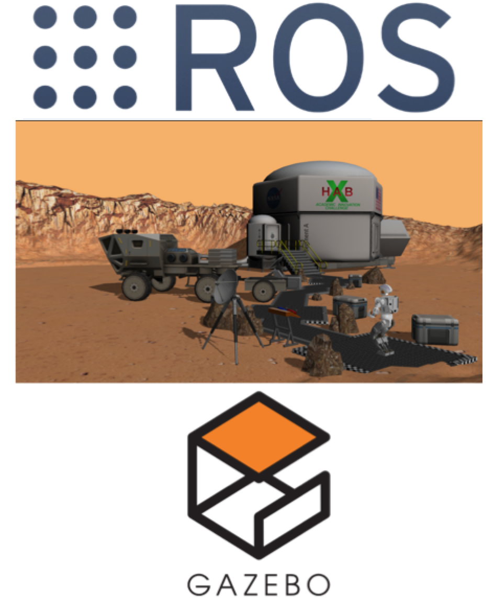
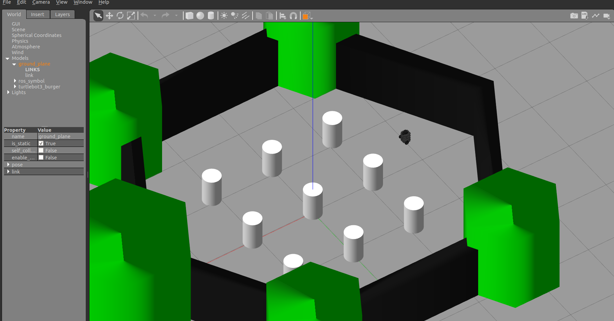

ROS Basics
=====




Main Objectives of this Tutorial
-----

1. The objective of this course is to give you the basic tools and knowledge to be able to understand and create any basic ROS related project. You will be able to **move robots, read their sensor data, make the robots perform intelligent tasks, see visual representations of complex data such as laser scans and debug errors in the programs.**
2. The course will allow you to **understand packages that others have done**. So you can take ROS code made by others and understand what is happening and how to modify it for your own purposes
3. This course can serve as an introduction to be able to understand the ROS documentation of complex ROS packages for object recognition, text to speech, navigation and all the other areas where has ROS developed code.

What is presented in this document is the main ROS concepts that are the core of ROS. These are the most important concepts that you have to master. Once you master them, the rest of ROS can follow easily.

Along the parts of this course, you will learn:

- How to **install ROS Kinetic and ROS packages** used in this tutorial.


- How **ROS Basic Structure** works.
- What are **ROS Topics** and how to use them.
- What are **ROS Services** and how to use them.
- What are **ROS Actions** and how to use them.
- How to use **ROS Debugging Tools** for finding errors in your programs (especially Rviz).

.. note::

  We will use **Python** as the programming language in all the course exercises

.. important::

  **DO NOT SKIP EXERCISES**. Exercises are the core of this tutorial (remember, practice, practice, practice). If you avoid them, you will be missing the whole thing.


Basic Concepts
------

What is ROS?
^^^^^^

ROS is a software framework for writing robot software. The main aim of ROS is to reuse the robotic software across the globe. ROS consists of a collection of tools, libraries, and conventions that aim to simplify the task of creating complex and robust robot behavior across a wide variety of robotic platforms.


Official definition on ROS WiKi is:

.. line-block::

  ROS is an open-source, meta-operating system for your robot. It provides the services you would expect from an operating system, including hardware abstraction, low-level device control, implementation of commonly-used functionality, message-passing between processes, and package management. It also provides tools and libraries for obtaining, building, writing, and running code across multiple computers. ROS is similar in some respects to 'robot frameworks, such as Player, YARP, Orocos, CARMEN, Orca, MOOS, and Microsoft Robotics Studio.

System Setup
^^^^^^^^

In this tutorial, we are going to work with a specific version of ROS called Kinetic. Also, some ROS packages are needed in order to perform the simulatoin exercises mentioned in this tutorial. The following sections will guide you through the installation procedures.

Install ROS Kinetic
""""""""""

ROS has many versions. The latest version at the time of writing this tutorial is *Lunar*. However, we are going to use the version that precedes *Lunar*, called *Kinetic*. This is because it has more support than *Lunar*.


.. note::

  The operating system that we are going to use is **Ubuntu 16.04**. ROS Kinetic does not work with Ubuntu 14.

Simply follow the instructions on the official ROS wiki `page <http://wiki.ros.org/kinetic/Installation/Ubuntu>`_ to install ROS Kinetic.


Install TurtleBot packages
""""""""

During this tutorial, you will work with a simulated robot called **TurtleBot**, to apply the concepts of ROS. The following image is a picture of the robot you will work with. It is a differential drive robot, that has a Kinect sensor for environmental mapping, wheel encoders for position estimation.


.. image:: ../_static/kobuki.jpg
   :scale: 50 %
   :align: center

For reference Turtlebot wiki `page <http://wiki.ros.org/Robots/TurtleBot>`_.

.. hint::

  To bring up a terminal window press ``CTRL+ALT+T``

To install the required packages, execute the following commands in a shell terminal.

.. code-block:: bash

  sudo apt-get install ros-kinetic-turtlebot ros-kinetic-turtlebot-apps ros-kinetic-turtlebot-interactions ros-kinetic-turtlebot-simulator ros-kinetic-turtlebot-gazebo -y


After installation is done, check that the simulation works in Gazebo. Execute the following commands in a shell terminal.


.. code-block:: bash

  roslaunch turtlebot_gazebo turtlebot_world.launch


You should get something similar to the following.



Move the robot
^^^^^^^^

How can you move the Turtlebot?

The easiest way is by executing an existing ROS program to control the robot. A ROS program is executed by using some special files called **launch files**.
Since a previously-made ROS program already exists that allows you to move the robot using the keyboard, let's launch that ROS program to teleoperate the robot.

Execute in a separate terminal:

.. code-block:: bash

  roslaunch turtlebot_teleop keyboard_teleop.launch

Read the instructions on the screen to know which keys to use to move the robot around, and start moving the robot!


Try it!! When you're done, you can ``Ctrl+C`` to stop the execution of the program.


So, you used a command called ``roslaunch``. What is that command?

``roslaunch``  is the command used to launch a ROS program. It's structure goes as follows:

.. code-block:: bash

  roslaunch <package_name> <launch_file>


As you can see, that command has two parameters: the first one is **the name of the package** that contains the launch file, and the second one is **the name of the launch file** itself (which is stored inside the package).

Now, what is a package?!

What is a package?
^^^^^^^

ROS uses **packages** to organize its programs. You can think of a package as **all the files that a specific ROS program contains**; all its cpp files, python files, configuration files, compilation files, launch files, and parameters files.
All those files in the package are organized with the following structure:

- ``launch`` folder: Contains launch files
- ``src`` folder: Source files (cpp, python)
- ``CMakeLists.txt``: List of cmake rules for compilation
- ``package.xml``: Package information and dependencies

To go to any ROS package, ROS gives you a command named ``roscd``. When typing:

.. code-block:: bash

  roscd <package_name>


It will take you to the path where the package *package_name* is located.


**Example**: navigate to the ``turtlebot_teleop`` package, and check that it has that structure.

.. code-block:: bash

  roscd turtlebot_teleop
  ls


``roscd`` is a command which will get you to a ROS package location. ``ls`` is a command that lists the content of a folder.

* Every ROS program that you want to execute is organized in a package.
* Every ROS program that you create will have to be organized in a package.
* Packages are the main organization system of ROS programs.

What is a launch file ?
^^^^^

We've seen that ROS uses launch files in order to execute programs. But... how do they work? Let's have a look.

lets  have a look at a launch file. Open the launch folder inside the ``turtlebot_teleop`` package and check the ``keyboard_teleop.launch`` file.

.. code-block:: bash

  roscd turtlebot_teleop
  cd launch
  cat keyboard_teleop.launch


You will see:

.. code-block:: xml

  <launch>
    <!-- turtlebot_teleop_key already has its own built in velocity smoother -->
    <node pkg="turtlebot_teleop" type="turtlebot_teleop_key" name="turtlebot_teleop_keyboard"  output="screen">
      <param name="scale_linear" value="0.5" type="double"/>
      <param name="scale_angular" value="1.5" type="double"/>
      <remap from="turtlebot_teleop_keyboard/cmd_vel" to="cmd_vel_mux/input/teleop"/>
    </node>
  </launch>


In the launch file, you have some extra tags for setting parameters and remaps. For now, don't worry about those tags and focus on the node tag.

All launch files are contained within a ``<launch>`` tag. Inside that tag, you can see a ``<node>`` tag, where we specify the following parameters:

- pkg="``package_name``": Name of the package that contains the code of the ROS program to execute
- type="``python_file_name.py``" : Name of the program file that we want to execute
- name="``node_name``" : Name of the ROS node that will launch our Python file
- output="``type_of_output``" : Through which channel you will print the output of the Python file

Create a package
^^^^^^^

Until now we've been checking the structure of an already-built package. But now, lets create one ourselves.
When we want to create packages, we need to work in a very specific ROS workspace, which is known as the **catkin workspace**. The **catkin workspace** is the directory in your hard disk where your own ROS packages must reside in order to be usable by ROS. Usually, the catkin workspace directory is called *catkin_ws*.

**Create catkin_ws**

Usually, the *catkin_ws* is created in the *home* folder of your user account. To go to the home folder, type ``cd`` in the command line. Then, create the *catkin_ws* as follows.

.. code-block:: bash

  mkdir -p catkin_ws/src


Go to the src folder inside *catkin_ws*

.. code-block:: bash

  cd catkin_ws/src


The `src` directory is the folder which holds created packages. Those could be your own packages, or packages that you copied from other sources e.g. *Github* repository.

In order for the ROS system to recognize the packages in your *catkin_ws*, it needs to be on the ROS file path. ROS file path is an Ubuntu environment variable that holds the paths to ROS packages. To add our catkin_ws to the ROS file path follow the following instructions.

First, build (compile) your workspace. It's OK to build the catkin_ws even if it has no packages. After the build process, some new folders will appear inside your catkin_ws. One of the folders, called `catkin_ws/devel` contains a setup file which will be used to add the path of the catkin_ws to the ROS file path. Build the *catkin_ws* using the ``catkin build`` inside the *catkin_ws*:

.. code-block:: bash

  # navigate to the catkin_ws
  cd ~/catkin_ws
  # build
  catkin build


Now, let's add the *catkin_ws* path. Execute the following command while being inside *catkin_ws*

.. code-block:: bash

  source devel/setup.bash


This will  add the *catkin_ws* path in the current terminal session. Once you close the terminal window, it forgets it! So, you will have to do it again each time you open a terminal in order for ROS to recognize your workspace! Yah, I know, that sucks! But no worries, there is a solution. You can automate the execution of the above command each time you open a terminal window. To do that, you want to add the above command to a special file called ``.bashrc`` that is located inside your home folder.

.. code-block:: bash

  # go to the home folder
  cd ~
  # open the .bashrc file
  nano .bashrc


add the command ``source ~/catkin_ws/devel/setup.bash`` to the end of ``.bashrc``. Then, hit ``CTRL+x``, then, ``y``, to save the changes to the file. Done!

Now, lets create a package.

.. important::
  Remember to create ROS packages inside the ``src`` folder

Create a package

.. code-block:: bash

  catkin_create_pkg my_package rospy


This will create, inside our ``src``, directory a new package with some files in it. We'll check this later. Now, let's see how this command is built:

.. code-block:: bash

  catkin_create_pkg <package_name> <package_dependecies>


The **package_name** is the name of the package you want to create, and the **package_dependencies** are the names of other ROS packages that your package depends on.

**Now, re-build your catkin_ws and source it as above.**

In order to check that our package has been created successfully, we can use some ROS commands related to packages. For example, let's type:

.. code-block:: bash

  rospack list
  rospack list | grep my_package
  roscd my_package 


``rospack list``: Gives you a list with all of the packages in your ROS system.
``rospack list | grep my_package``: Filters, from all of the packages located in the ROS system, the package named *my_package*.
``roscd my_package``: Takes you to the location in the Hard Drive of the package, named *my_package*.

Your First ROS Program
^^^^^^^

At this point, you should have your first package created... but now you need to do something with it! Let's do our first ROS program!

1. Create in the ``src`` directory in ``my_package`` a python file that will be executed. For this exercise, just copy this simple python code ``simple.py`` below.

.. code-block:: python

  #! /usr/bin/env python
  # The previous line will ensure the interpreter used is the first one on your environment's $PATH. Every Python file needs to start with this line at the top.

  import rospy # Import the rospy, which is a Python library for ROS.

  rospy.init_node('simple_node') # Initiate a node called ObiWan
  
  print "Help me body, you are my only hope" # A simple Python print


2. Save the file. You will need to make this file executable by using the ``chmod`` linux command as follows.

.. code-block:: bash

  # navigate to the src folder inside my_package
  roscd my_package/src
  # make the python file executable
  chmod +x simple.py

3. Create a ``launch`` directory inside the package named ``my_package``

.. code-block:: bash

  roscd my_package
  # the following command creates a directory
  mkdir launch

4. Create a new launch file inside that launch directory

.. code-block:: bash

  gedit launch/my_package_launch_file.launch  

5. Fill this launch file as we've previously seen in the launch file of the ``turtlebot_teleop`` package,

.. code-block:: xml

  <launch>
    <!-- turtlebot_teleop_key already has its own built in velocity smoother -->
    <node pkg="turtlebot_teleop" type="turtlebot_teleop_key" name="turtlebot_teleop_keyboard"  output="screen">
      <param name="scale_linear" value="0.5" type="double"/>
      <param name="scale_angular" value="1.5" type="double"/>
      <remap from="turtlebot_teleop_keyboard/cmd_vel" to="cmd_vel_mux/input/teleop"/>
    </node>
  </launch>

6. Modify the launch file to run your ROS program ``simple.py``

.. code-block:: xml

  <launch>
   <!-- run simple.py from my_package -->
   <node pkg="my_package" type="simple.py" name="simple_node"  output="screen">
   </node>
  </launch>

7. Finally, execute the ``roslaunch`` command in the terminal in order to launch your program.

.. code-block:: bash

  roslaunch my_package my_package_launch_file.launch

You should see the print statement 

.. code-block:: bash

  Help me body, you are my only hope

.. hint::
  Usually, when we add ROS program to a package, we re-build the *catkin_ws* and source it. However, since we are working with ``Python``, we will not need to do that for now, because a Python code does not need to compile. If you write a ``C++`` ROS program, then, you will need to re-build your *catkin_ws*.


ROS Nodes
^^^^^^

You've initiated a node in the previous code but... what's a node? ROS nodes are basically programs made in ROS. The ROS command to see what nodes are actually running in a computer is:

.. code-block:: bash

  rosnode list


Type the previous command in a new terminal and look for the node you've just initiated ``simple_node``.

You can't find it? I know you can't. That's because the node is killed when the Python program ends. Let's change that.

Update your Python file ``simple.py`` with the following code:

.. code-block:: python

  #! /usr/bin/env python

  import rospy

  rospy.init_node("simple_node")
  rate = rospy.Rate(2)               # We create a Rate object of 2Hz
  while not rospy.is_shutdown():     # Endless loop until Ctrl + C
     print "Help me body, you are my only hope"
     rate.sleep()                    # We sleep the needed time to maintain the Rate fixed above
      
  # This program creates an endless loop that repeats itself 2 times per second (2Hz) until somebody presses Ctrl + C in the Shell


Launch your program again using the ``roslaunch`` command.

.. code-block:: bash

  roslaunch my_package my_package_launch_file.launch


Now try again in another terminal window:

.. code-block:: bash

  rosnode list


Can you now see your node? You should be!


In order to see information about our node, we can use the next command:

.. code-block:: bash

  rosnode info /simple_node


This command will show us information about all the connections that our Node has.

Parameters Server
^^^^^^

A Parameter Server is a dictionary that ROS uses to store parameters. These parameters can be used by nodes at runtime and are normally used for static data, such as configuration parameters.

To get a list of these parameters, you can type:

.. code-block:: bash

  rosparam list


To get a value of a particular parameter, you can type:

.. code-block:: bash

  rosparam get <parameter_name>


And to set a value to a parameter, you can type:

.. code-block:: bash

  rosparam set <parameter_name> <value>


You can create and delete new parameters for your own use, but do not worry about this right now. You will learn more about this later.

ROSCORE
^^^^^

In order to have all of this working, we need to have a roscore running. The roscore is the main process that manages all of the ROS system. You always need to have a roscore running in order to work with ROS. The command that launches a roscore is:

.. code-block:: bash

  roscore


So, this is the first command that should be executed before using other ROS functionalities.

.. hint::
  
  When you use ``roslaunch`` to run your ROS nodes, it automatically runs ``roscore`` if it is not already run.


Environment Variables
^^^^^^

ROS uses a set of Linux system environment variables in order to work properly. You can check these variables by typing:

.. code-block:: bash

  export | grep ROS


You will get something similar to:

.. code-block:: bash

  user ~ $ export | grep ROS
  declare -x ROSLISP_PACKAGE_DIRECTORIES="/home/user/catkin_ws/devel/share/common-lisp"
  declare -x ROS_DISTRO="kinetic"
  declare -x ROS_ETC_DIR="/opt/ros/kinetic/etc/ros"
  declare -x ROS_MASTER_URI="http://localhost:11311"
  declare -x ROS_PACKAGE_PATH="/home/user/catkin_ws/src:/opt/ros/kinetic/share:/opt/ros/kinetic/stacks"
  declare -x ROS_ROOT="/opt/ros/kinetic/share/ros"


The most important variables are the **ROS_MASTER_URI** and the **ROS_PACKAGE_PATH**.

**ROS_MASTER_URI**: Contains the url where the ROS Core is being executed. Usually, your own computer (localhost).
**ROS_PACKAGE_PATH**: Contains the paths in your Hard Drive where ROS has packages in it.

Summary
^^^^^

So, now, what is ROS again?

ROS is basically the framework that allows us to do all that we showed along this chapter. It provides the background to manage all these processes and communications between them... and much, much more!! In this tutorial you've just scratched the surface of ROS, the basic concepts. ROS is an extremely powerful tool. If you dive into our courses you'll learn much more about ROS and you'll find yourself able to do almost anything with your robots!


Next we will start to talk about ROS topics, services, actions,and finally some debugging tools.


ROS Topics
------

**What will you learn with this part?**

* What are ROS topics and how to manage them?
* What is subscribers and publisher and how to create them?
* What are topic messages and how they work?

We will start by learning about  a publisher.

What is a Publisher?
^^^^^^^^^^^

Let's create a ROS node that uses a publisher to publish some data. In the ``src`` folder of your package ``my_package``, create the following node, and name it ``simple_node_publisher.py``:

.. code-block:: python

  #! /usr/bin/env python

  import rospy                               # Import the Python library for ROS
  from std_msgs.msg import Int32             # Import the Int32 message from the std_msgs package

  rospy.init_node('topic_publisher')         # Initiate a Node named 'topic_publisher'
  pub = rospy.Publisher('counter', Int32)    # Create a Publisher object, that will publish on the /counter topic
                                             #  messages of type Int32

  rate = rospy.Rate(2)                       # Set a publish rate of 2 Hz
  count = Int32()                            # Create a var of type Int32
  count.data = 0                             # Initialize 'count' variable

  while not rospy.is_shutdown():             # Create a loop that will go until someone stops the program execution
    pub.publish(count)                       # Publish the message within the 'count' variable
    count.data += 1                          # Increment 'count' variable
    rate.sleep()                             # Make sure the publish rate maintains at 2 Hz


Use what you know about launch files to create a launch file to run this node. Let the launch file name be ``launch_publisher.launch``. Run the launch file using ``roslaunch``

You have just created a topic named ``/counter``, and published through it as an integer that increases indefinitely. Wait! What is a topic?.

**ROS Topic**: A topic is like a pipe. **Nodes use topics to publish information for other nodes** so that they can communicate. You can find out, at any time, the number of topics in the system by doing a ``rostopic list``. You can also check for a specific topic.

Now, given that you are still running the node you just created, execute the following command in a new terminal window.

.. code-block:: bash

  rostopic list | grep  '/counter'

Here, you have just listed all of the topics running right now and filtered with the **grep** command the ones that contain the word ``/counter``. If it appears, then the topic is running as it should.

You can request information about a topic by doing ``rostopic info <name_of_topic>'``.

Now, type

.. code-block:: bash

  rostopic info /counter


You should get something like this

.. code-block:: bash

  Type: std_msgs/Int32
  Publishers:
   * /topic_publisher (http://ip-172-31-16-133:47971/)
  Subscribers: None


The output indicates the type of information published ``std_msgs/Int32``, the node that is publishing ``/topic_publisher``, and if there is a node listening to that info (None in this case).

Now, let's check the output of the ``/counter`` topic

.. code-block:: bash

  rostopic echo /counter


You should see a succession of consecutive numbers, similar to the following

.. code-block:: bash

  rostopic echo /counter
  data:
  985
  ---
  data:
  986
  ---
  data:
  987
  ---
  data:
  988
  ---


So, what has just happened? Go back and take a look at the comments in the last code.

So basically, what this code does is to **initiate a node and create a publisher that keeps publishing into the ``/counter`` topic a sequence of consecutive integers**.

Summarizing:

* **A publisher is a node that keeps publishing a message into a topic**. So now... what's a topic?

* **A topic is a channel that acts as a pipe, where other ROS nodes can either publish or read information**. Let's now see some commands related to topics (some of them you've already used).

* To **get a list of available topics** in a ROS system, you have to use the next command:

.. code-block:: bash

  rostopic list


To **read the information that is being published in a topic,** use the next command:

.. code-block:: bash

  rostopic echo <topic_name>


This command will start printing all of the information that is being published into the topic, which sometimes (ie: when there's a massive amount of information, or when messages have a very large structure) can be annoying. In this case, you can **read just the last message published into a topic** with the next command:

.. code-block:: bash

  rostopic echo <topic_name> -n1


To **get information about a certain topic,** use the next command:

.. code-block:: bash

  rostopic info <topic_name>


Finally, you can check the different options that ``rostopic`` command has by using the next command:

.. code-block:: bash

  rostopic -h


ROS Messages
^^^^^^^

As you may have noticed, topics handle information through messages. There are many different types of messages.

In the case of the code you executed before, the message type was an ``std_msgs/Int32``, but ROS provides a lot of different messages. You can even create your own messages, but it is recommended to use ROS default messages when its possible.

Messages are defined in **<name>.msg** files, which are located inside a ``msg`` directory of a package.

To **get information about a message,** you use the next command:

.. code-block:: bash

  rosmsg show <message>


For example, let's try to get information about the ``std_msgs/Int32`` message. Type the following command and check the output.

.. code-block:: bash

  rosmsg show std_msgs/Int32


You should get something like

.. code-block:: bash

  [std_msgs/Int32]:
  int32 data


In this case, the ``Int32`` message has only one variable named ``data`` of type ``int32``. This ``Int32`` message comes from the package ``std_msgs``, and you can find it in its ``msg`` directory. If you want, you can have a look at the ``Int32.msg`` file by executing the following command:

.. code-block:: bash

  roscd std_msgs/msg


Exercise: Move the Robot
^^^^^^

Now you're ready to create your own publisher and make the robot move, so let's go for it!

Create a launch file that launches the code ``simple_topic_publisher.py`` (you should have already done that in a previous step)

Modify the code you used previously to publish data to the ``cmd_vel_mux/input/teleop`` topic.

Launch the program and check that the robot moves.


.. hint::

  First, you need to bring up the robot simulation in Gazebo.

  The ``cmd_vel_mux/input/teleop`` topic is the topic used to move the robot. Do a ``rostopic info cmd_vel_mux/input/teleop`` in order to get information about this topic, and identify the message it uses. You have to modify the code to use that message.

  In order to fill the Twist message, you need to create an instance of the message. In Python, this is done like this: ``var = Twist()``

  In order to know the structure of the Twist messages, you need to use the ``rosmsg show`` command, with the type of the message used by the topic ``cmd_vel_mux/input/teleop``.

  In this case, the robot uses a differential drive plugin to move. That is, the robot can only move linearly in the *x* axis, or rotationally in the angular *z* axis. This means that the only values that you need to fill in the Twist message are the linear x and the angular *z*.

  .. image:: ../_static/xyz-frame.jpg
    :scale: 50 %
    :align: center

  The magnitudes of the Twist message are in m/s, so it is recommended to use values between 0 and 1. For example, *0.5 m/s*

  Solution to the exercise is available, **but** try to do it yourself and fight for it!

ROS Subscriber
^^^^^^

You've learned that a topic is a channel where nodes can either write or read information. You've also seen that you can write into a topic using a publisher, so you may be thinking that there should also be some kind of similar tool to read information from a topic. And you're right! That's called a subscriber. **A subscriber is a node that reads information from a topic**. Let's create a subscriber node.

.. important::

  Make sure that you terminated all terminal sessions before you continue

Create a Python node named ``simple_topic_subscriber.py`` and copy the following code

.. code-block:: python

  #! /usr/bin/env python

  import rospy                                          
  from std_msgs.msg import Int32 

  def callback(msg):                                    # Define a function called 'callback' that receives a parameter 
                                                        # named 'msg'
    
    print msg.data                                      # Print the value 'data' inside the 'msg' parameter

  rospy.init_node('topic_subscriber')                   # Initiate a Node called 'topic_subscriber'

  sub = rospy.Subscriber('/counter', Int32, callback)   # Create a Subscriber object that will listen to the /counter
                                                        # topic and will cal the 'callback' function each time it reads
                                                        # something from the topic
  rospy.spin()                                          # Create a loop that will keep the program in execution


Save the node.

.. important::

  Don't forget to give execution permission to the node using ``chmod`` command

As you did for the publisher node, create a *launch* file named ``subscriber_launch.launch``, in the launch folder, which launches this node.

Run the launch file using ``roslaunch my_package subscriber_launch.launch`` command

What's up? Nothing happened again? Well, that's not actually true... Let's do some checks.

* Go to a new terminal and execute

.. code-block:: bash

  rostopic echo /counter


You should see an output like

.. code-block:: bash

  WARNING: no messages received and simulated time is active.
  Is /clock being published?


And what does this mean? This means that nobody is publishing into the ``/counter`` topic, so there's no information to be read. Let's then publish something into the topic and see what happens.

For that, let's introduce a new command:

.. code-block:: bash

  rostopic pub <topic_name> <message_type> <value>


This command will publish the message you specify with the value you specify, in the topic you specify.

Open a new terminal window (leave the one with the ``rostopic echo`` opened) and type the next command

.. code-block:: bash

  rostopic pub /counter std_msgs/Int32 5


You will see something similar to the following

.. code-block:: bash

  WARNING: no messages received and simulated time is active.
  Is /clock being published?
  data:
  5
  ---

This means that the value you published has been received by your subscriber program (which prints the value on the screen).

So now, let's explain what has just happened. You've basically created a subscriber node that listens to the ``/counter`` topic, and each time it reads something, it calls a function that does a print of the msg. Initially, nothing happened since nobody was publishing into the ``/counter`` topic, but when you executed the ``rostopic pub`` command, you published a message into the ``/counter`` topic, so the function has printed the number and you could see that message in the ``rostopic echo`` output. Now everything makes sense, right? I hope!

Now let's do some exercises to put into practice what you've learned!

Exercise: Print Robot's Odometry
^^^^^^^

Modify the code in the publisher node in order to print the odometry of the robot.

The odometry of the robot is published by the robot into the ``/odom`` topic.

You will need to figure out what message uses the ``/odom`` topic, and how the structure of this message is.

Solution is available, but try yourself and fight for it!

Exercise: Publishing to Custom Message
^^^^^^^^

Create a python file (e.g. ``publish_age.py``) that creates a publisher which publishes the age of the robot, to the previous package. 

For that, you'll need to create a new message called ``Age.msg``. See the detailed description below on how to prepare ``CMakeLists.txt`` and ``package.xml`` for custom topic message compilation.

Solution is available,**but** try yourself and fight for it!

Creating Custom Messages
^^^^^^^

Now you may be wondering... in case I need to publish some data that is not an ``Int32``, which type of message should I use? You can use all ROS defined (``rosmsg list``) messages. But, in case none fit your needs, you can create a new one.

In order to create a new message, you will need to do the following steps:

Create a directory named ``msg`` inside your package, e.g. ``my_package/msg``

Inside this directory, create a file named ``Name_of_your_message.msg`` (more information down)

Modify ``CMakeLists.txt`` file (more information down)

Modify ``package.xml`` file (more information down)

Compile

Use in code

For example, let's create a message that indicates age, with years, months, and days.

Create a directory msg in your package.

.. code-block:: bash

  roscd my_package
  mkdir msg


Add the ``Age.msg`` file which must contain this:

.. code-block:: bash

  float32 years
  float32 months
  float32 days


Save it.

In ``CMakeLists.txt`` of your package, you will have to edit four functions.

  - find_package()
  - add_message_files()
  - generate_messages()
  - catkin_package() 

``find_package()``

This is where all the packages required to COMPILE the messages of the topics, services, and actions go. In package.xml, you have to state them as ``build_depend``.


.. hint::

  If you open the ``CMakeLists.txt`` file in your IDE, you'll see that almost all of the file is commented. This includes some of the lines you will have to modify. Instead of copying and pasting the lines below, find the equivalents in the file and uncomment them, and then add the parts that are missing.


.. code-block:: bash

  find_package(catkin REQUIRED COMPONENTS
         rospy
         std_msgs
         message_generation   # Add message_generation here, after the other packages
  )


``catkin_package()``

State here all of the packages that will be needed by someone that executes something from your package. All of the packages stated here must be in the package.xml as ``run_depend``.

.. code-block:: bash

  catkin_package(
        CATKIN_DEPENDS rospy message_runtime   # This will NOT be the only thing here
  )


``add_message_files()``

This function includes all of the messages of this package (in the ``msg`` folder) to be compiled. The file should look like this.

.. code-block:: bash

  add_message_files(
        FILES
        Age.msg
      ) # Don't Forget to uncomment the parenthesis and add_message_files TOO


``generate_messages()``

Here is where the packages needed for the messages compilation are imported.

.. code-block:: bash

  generate_messages(
        DEPENDENCIES
        std_msgs
  ) # Dont Forget to uncomment here too


In summary, this is the minimum expression of what is needed for the ``CMakeLists.txt`` to work:

.. code-block:: bash

  cmake_minimum_required(VERSION 2.8.3)
  project(my_package)


  find_package(catkin REQUIRED COMPONENTS
    std_msgs
    message_generation
  )

   add_message_files(
     FILES
     Age.msg
   )

   generate_messages(
     DEPENDENCIES
     std_msgs
   )


  catkin_package(
    CATKIN_DEPENDS rospy message_runtime
  )

  include_directories(
    ${catkin_INCLUDE_DIRS}
  )
  ```

Modify ``package.xml`` by adding these 2 lines.

.. code-block:: xml

  <build_depend>message_generation</build_depend> 
  <run_depend>message_runtime</run_depend>


This is the minimum expression of the ``package.xml``

.. code-block:: xml

  <?xml version="1.0"?>
  <package>
    <name>my_package</name>
    <version>0.0.0</version>
    <description>The my_package package</description>

    <maintainer email="user@todo.todo">user</maintainer>

    <license>TODO</license>

    <buildtool_depend>catkin</buildtool_depend>
    <build_depend>rospy</build_depend>
    <build_depend>message_generation</build_depend> 
    <run_depend>rospy</run_depend>
    <run_depend>message_runtime</run_depend>
    
    <export>
    
    </export>
  </package>


Now you have to compile the msgs. To do this, you have to type in the terminal,

.. code-block:: bash

  cd ~/catkin_ws
  catkin build
  source devel/setup.bash


.. warning::

  When you compile new messages, there is still an extra step before you can use the messages. You have to type in the terminal, in the *catkin_ws*: ``source devel/setup.bash``. This executes this bash file that sets, among other things, the newly generated messages created through the ``catkin build``. If you don't do this, it might give you a python import error, saying it doesn't find the message generated.


.. hint::

  To verify that your message has been created successfully, type in your terminal ``rosmsg show Age``. If the structure of the Age message appears, it will mean that your message has been created successfully and it's ready to be used in your ROS programs.


Execute in a terminal

.. code-block:: bash

  rosmsg show Age


You should get

.. code-block:: bash

  [my_package/Age]:
  float32 years
  float32 months
  float32 days


.. warning::

  There is an issue in ROS that could give you problems when importing msgs from the ``msg`` directory. **If your package has the same name as the Python file that does the import of the msg**, this will give an error saying that it doesn't find the msg element. This is due to the way Python works. Therefore, you have to be careful to **not name the Python file exactly the same as its parent package**.

  Example:

  Package name = ``my_package``

  Python file name = ``my_package.py``

  This will give an import error because it will try to import the message from the ``my_package.py`` file, from a directory ``.msg`` that doesn't exists.


Project
^^^^^^^^

.. image:: ../_static/topics_mini_project.png
   :scale: 50 %
   :align: center

With all you've learned during this course, you're now able to do a small project to put everything together. Subscribers, Publisher, Messages... you will need to use all of this concepts in order to execute the following mini project!

In this project, you will create a code to make the robot avoid the wall that is in front of it. To help you achieve this, let's divide the project down into smaller units:

Create a Publisher that writes into the ``/cmd_vel`` topic in order to move the robot.

Create a Subscriber that reads from the ``/kobuki/laser/scan topic``. This is the topic where the laser publishes its data.

Depending on the readings you receive from the laser's topic, you'll have to change the data you're sending to the ``/cmd_vel`` topic, in order to avoid the wall. This means, use the values of the laser to decide.

.. hint::
  
  The data that is published into the ``/kobuki/laser/scan`` topic has a large structure. For this project, you just have to pay attention to the ``ranges`` array.


To check the laser message type, execute the following:

.. code-block:: bash

  rosmsg show sensor_msgs/LaserScan

You should get

.. code-block:: bash

  std_msgs/Header header
    uint32 seq
    time stamp
    string frame_id
  float32 angle_min
  float32 angle_max
  float32 angle_increment
  float32 time_increment
  float32 scan_time
  float32 range_min
  float32 range_max
  float32[] ranges <-- Use only this one
  float32[] intensities


.. hint::

  The ``ranges`` array has a lot of values. The ones that are in the middle of the array represent the distances that the laser is detecting right in front of him. This means that the values in the middle of the array will be the ones that detect the wall. So in order to avoid the wall, you just have to read these values.


.. hint::

  The laser has a range of 30m. When you get readings of values around 30, it means that the laser isn't detecting anything. If you get a value that is under 30, this will mean that the laser is detecting some kind of obstacle in that direction (the wall).


.. hint::

  The scope of the laser is about 180 degrees from right to left. This means that the values at the beginning and at the end of the ``ranges`` array will be the ones related to the readings on the sides of the laser (left and right), while the values in the middle of the array will be the ones related to the front of the laser.


So, in the end, you probably will get something like the following:

The robot moves forward until it detects an obstacle in front of it which is closer than 1 meter, so it begins to turn left in order to avoid it.


.. image:: ../_static/mini_project_1.gif
   :scale: 50 %
   :align: center


The robot keeps turning left and moving forward until it detects that it has an obstacle at the right side which is closer than 1 meter, so it stops and turns left in order to avoid it.

.. image:: ../_static/mini_project_2.gif
   :scale: 50 %
   :align: center

ROS Services
--------------------

**Services** are another way that nodes can communicate with each other. Services allow nodes to send a **request** and receive a **response**.

As you have seen, ROS topics are means of communications between nodes, but they don't execute functionalities. They just hold data. Services, however, can provide a specific functionality once they receive a request to do so. For example, a service can provide the number of detected person in an image.

A service has two parts, **server** and **client**

A service **server** is a ROS program the implements certain functionality. Once it is executed, it will wait for a call from a **client**. Once a call use received, it will execute its functionality and provide a **response**.

A **client** uses some ROS commands to **request** a service from a service **server**


.. image:: ../_static/services.png
   :scale: 50 %
   :align: center


In this part, we are going to use a different simulation setup, a simpler one, called ``turtlesim``


.. image:: ../_static/turtlesim.png
   :scale: 50 %
   :align: center

To install ``turtlesim``

.. code-block:: bash

  sudo apt-get install ros-kinetic-turtlesim 


To run the ``turtlesim`` node and control the turtle using keyboard, execute

.. code-block:: bash

  # run roscore in a seperate terminal
  roscore
  # in a separate terminal, run the sim node
  rosrun turtlesim turtlesim_node
  # in a separate terminal, run the keyboard telep node
  rosrun turtlesim turtle_teleop_key


The main ROS command used with services is called ``rosservice``. The following some commands that can be used on service topics.

.. code-block:: bash

  rosservice list         # print information about active services
  rosservice call         # call the service with the provided args
  rosservice type         # print service type
  rosservice find         # find services by service type
  rosservice uri          # print service ROSRPC uri


Command ``rosservice list``
^^^^^^

Now, lets check the available ROS services using the ``rosservice`` command

.. code-block:: bash

  rosservice list


The ``list`` command shows us that the turtlesim node provides nine services: ``reset``, ``clear``, ``spawn``, ``kill``, ``turtle1/set_pen``, ``/turtle1/teleport_absolute``, ``/turtle1/teleport_relative``, ``turtlesim/get_loggers``, and ``turtlesim/set_logger_level``. There are also two services related to the separate ``rosout`` node: ``/rosout/get_loggers`` and ``/rosout/set_logger_level``. After executing the previous command, you will get some output like the following:

.. code-block:: bash

  /clear
  /kill
  /reset
  /rosout/get_loggers
  /rosout/set_logger_level
  /spawn
  /teleop_turtle/get_loggers
  /teleop_turtle/set_logger_level
  /turtle1/set_pen
  /turtle1/teleport_absolute
  /turtle1/teleport_relative
  /turtlesim/get_loggers
  /turtlesim/set_logger_level


Let's look more closely at the ``clear`` service using ``rosservice type``:

Command ``rosservice type``
^^^^^

The command can be used as follows:

.. code-block:: bash

  rosservice type [service]


Let's try to find the type of ``clear`` service

.. code-block:: bash

  rosservice type /clear


You will get something like:

.. code-block:: bash
  
  std_srvs/Empty


This service is empty, this means when the service call is made it takes no arguments (i.e. it sends no data when making a **request** and receives no data when receiving a **response**). Let's call this service using ``rosservice call``:

Command ``rosservice call``
^^^^^

The command can be used as follows:

.. code-block:: bash

  rosservice call [service] [arguments]


Here we'll call with no arguments because the service is of type empty:

.. code-block:: bash

  rosservice call /clear


This does what we expect, it clears the background of the ``turtlesim_node``.


.. image:: ../_static/turtlesim_clear.png
   :scale: 50 %
   :align: center


Let's look at the case where the service has arguments by looking at the information for the service spawn:

.. code-block:: bash
  
  rosservice type /spawn | rossrv show


The previous command does two things at once. First, it finds the message type of the service ``/spawn`` using ``rosservice type [service]`` command. Then, it shows the message content using the command ``rossrv show``.

You will get something like:

.. code-block:: bash

  float32 x
  float32 y
  float32 theta
  string name
  ---
  string name


This service ``/spawn`` lets us spawn a new turtle at a given location and orientation. The name field is optional, so let's not give our new turtle a name and let turtlesim create one for us.

.. code-block:: bash

  rosservice call /spawn 2 2 0.2 ""


.. hint::
  You can use the autocomplete feature to get the service msg *fields* when you use ``rosservice call [service][args]`` so you don't have to remember the ``[args]`` yourself. To do that, just hit ``TAB`` key twice after you write ``rosservice call [service]``


After executing the previous command, you will get something like:

.. image:: ../_static/2_turtles.png
   :scale: 50 %
   :align: center


Until now, you have called services from the command line. There are three more things that you need to know.

* Writing a code for ROS service to execute certain functionality
* Writing ROS node that calls a service
* Writing custom service message

For writing ROS services and clients, I refer you to the following ROS WiKi page for more details.

http://wiki.ros.org/ROS/Tutorials/WritingServiceClient%28python%29

For writing custom messages, I refer you to the following ROS WiKi page for more details.

http://wiki.ros.org/ROS/Tutorials/CreatingMsgAndSrv


Remaining concepts
-----------

ROS action
^^^^^

Rviz
^^^^^

rosbag
^^^^^

Useful Video Tutorials
-------

* ROS: Introduction, Installing ROS, and running the Turtlebot simulator.
  * https://www.youtube.com/watch?v=9U6GDonGFHw

* Publishers and subscribers
  * https://www.youtube.com/watch?v=bJB9tv4ThV4

* Python walkthrough of publisher/subscriber lab
  * https://www.youtube.com/watch?v=DLVyc9hOvk8

* To learn more about Nodes and Topics, check the following video:
  * https://www.youtube.com/watch?v=Yx_vGAt74sk  ​


Contributors
-----

Main contributor is `Mohamed Abdelkader <https://github.com/mzahana>`_.