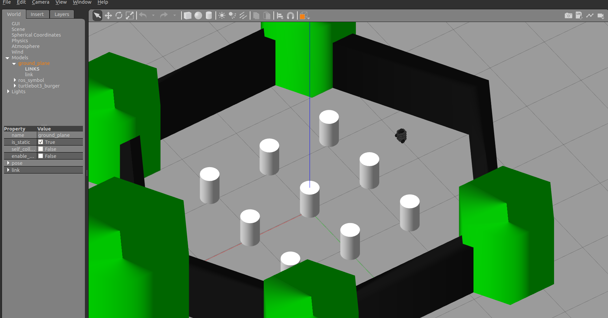

ROS Navigation
=======

Introduction
-----

In this tutorial you will learn how to program a mobile robot using ROS to navigate from point A to point B autonomously while avoiding obstacles.

**You will learn by doing**. Specifically, in each of the three main topics in this tutorial, you will follow the following steps.

* **Running a complete example.** First, for each topic, you will run a set of available ROS programs to perform the tasks discussed in this tutorial in order to get familiar with the tools.
* **Analyze examples**. Next, we will dig deeper into the examples and understand how it works.
* **Do exercises**. To make sure that you understand and enforce the concepts you learned, a set of exercises are provided for you to solve. Solutions for those exercises are available. **However**,

.. important::

	You will only learn the concepts mentioned here by **practicing**. Remember to practice, practice, and practice ….

In this tutorial, you will work with a simulated robot called ``TurtleBot`` in the Gazebo simulator.

Prerequisites
-------

This tutorial assumes the following.

* You are familiar with ROS basics e.g. topics, services, actions, how to write ROS nodes in Python, and ROS command line tools
* ROS Kinetic (Desktop-Full install) is installed on Ubuntu 16.04 LTS
  http://wiki.ros.org/kinetic/Installation/Ubuntu
* Gazebo 7. Comes by default with ROS Kinetic
* A good PC. Recommended i5 with minimum of 8GB RAM
* Basic programing in Python

Topics Covered
-----

For a robot to navigate autonomously it needs the following.

* A **map** of the world or the environment of interest. You will learn how to create a map using  laser scans and 2D SLAM ROS programs that are already available. You will also know how use a map that is already available. The ROS package that will be used for mapping is called ``gmapping``

  
.. image:: ../_static/ros_map.jpg
   :scale: 50 %
   :align: center

* **Localization**. A robot needs to know where it is inside the map in order to know how to go to a goal location. You will learn how to use a localization algorithm already implemented in ROS to help the robot estimate its location in a given map based on 2D laser scans. The ROS package that will be used for localization is called `amcl`, Adaptive Monte Carlo Localization.

.. image:: ../_static/ros_amcl.png
   :scale: 50 %
   :align: center

* **Path planing**. This is the process of generating a sequence of points (path) between a start point and a goal point.

* **Path following**. This is the process of following the path that is planned while avoiding obstacles. The ROS package that will be used here for navigation is called `move_base`

.. image:: ../_static/ros_path_plan.png
   :scale: 50 %
   :align: center

In all the tutorials, you will be using ``Rviz`` which is a very powerful ROS tool for visualizing the status of your robot, sensor information, map building,  navigation, and debugging.

Environment Setup
-----

During this tutorial, you will work with a simulated robot called TurtleBot, to apply the concepts of navigation using ROS. The following image is a picture of the robot you will work with. It is a differential drive robot, that has a Kinect sensor for environmental mapping, wheel encoders for pose estimation.

.. image:: ../_static/kobuki.jpg
   :scale: 50 %
   :align: center

Install TurtleBot packages
^^^^^^

.. code-block:: bash

	sudo apt-get install ros-kinetic-turtlebot ros-kinetic-turtlebot-apps ros-kinetic-turtlebot-interactions ros-kinetic-turtlebot-simulator ros-kinetic-turtlebot-gazebo -y

After installation is done, check that the simulation works in Gazebo. Execute the following commands in a shell terminal.

.. code-block:: bash

	roslaunch turtlebot_gazebo turtlebot_world.launch

.. attention::

	It might take long time if you are opening the previous Gazebo world for the first time. Just be patient.

You should get something similar to the following.

Tele-operating the Robot
------

You will need to move the robot around somehow in order to build a map of the world in the coming sections. You can move it using a *keyboard* or a *joystick*.

``turtlebot_teleop`` package provides nodes and launch file to move the robot by either a *keyboard* or a *joystick*. There is one *launch* file for keyboard teleoperation and three *launch* files for three different joysticks. To navigate to the launch file folder, execute the following.

.. code-block:: bash

	roscd turtlebot_teleop/launch

To move the robot using a keyboard, execute the corresponding *launch*  file in a separate terminal, after you launch the TurtleBot's world.

.. code-block:: bash

	roslaunch turtlebot_teleop keyboard_teleop.launch

Use the keys as mentioned on the screen to move the robot.

To move the robot using a joystick (we will assume Logitech F710 joystick), execute the following.

.. code-block:: bash

	roslaunch turtlebot_teleop logitech.launch

.. hint::

	You you will need to press certain button combination in order to control the robot with the joystick. Read the instruction in the ``logitech.launch`` file.

.. important::

	Make sure that your joystick is given the required privileges. Use ``sudo chmod a+rw /dev/input/jsX`` (``X`` is the device number) to give the required privileges to your joystick.

Rviz
------

**Rviz** (ROS visualization) is a 3D visualizer for displaying sensor data and state information from ROS. You can also display live representations of sensor values coming over ROS Topics including camera data, infrared distance measurements, sonar data, and more.

We will be using Rviz all the way in this tutorial. Now, let's see how we can show simple things in Rviz.

**Running Rviz**. Make sure that you launched a turtlebot world. Next, in a separate terminal, run rviz using the following command.

.. code-block:: bash

	rosrun rviz rviz

**Adding displays.** Next, we will need to add the information that we would like to visualize. This is called *Displays*. On the left side of Rviz, there is a column called *Displays*. The first thing we need to adjust is the **Fixed frame** field. Choose the ``odom`` frame. This is the frame that is created at the initial point of the robot when you launched your turtlebot world, then it becomes fixed for the rest of the simulation. It's called local fixed frame.

**Adding Robot Model**. To show the robot 3D model, we will need to add a display for that. Click on the **Add** button in the lower left corner of the *Displays* column. Then, choose **RobotModel**. You should see the robot model in the middle screen.

.. image:: ../_static/rviz_robotmodel.png
   :scale: 50 %
   :align: center

**Adding a display for laser scans**. To show what the laser scanner detects on the robots, you can add a ``LaserScan`` display. After adding the display, you will need to specify the topic that has the laser scans reading. In this case it is called ``/scan``

See following snapshots to know what to expect your rviz configs to be like.

.. image:: ../_static/rviz_addDisplay.png
   :scale: 50 %
   :align: center

.. image:: ../_static/rviz_laser.png
   :scale: 50 %
   :align: center

Now, you have a basic idea on how to use Rviz to visualize your robots states. Later, we will also use it to visualize the map we built or while we are building it, paths we want to navigate, and how to use it to set goal waypoints.

.. hint::

	If you close Rviz, you will lose the displays and the configs you made. You can save the current configs you did in order to load it quickly next time you launch Rviz. Just use the *File* menu and choose *save config as*.

Now it's time to build a map!

Mapping
-------

The first step we need to do in order to be able to perform autonomous navigation is to **build a map**.

In this tutorial we will learn how to create a 2D map with a ROS package called ``gmapping``. Here is the definition of the package according to the official WiKi (http://wiki.ros.org/gmapping)

.. note::

    The gmapping package provides laser-based SLAM (Simultaneous Localization and Mapping), as a ROS node called slam_gmapping. Using slam_gmapping, you can create a 2-D occupancy grid map (like a building floorplan) from laser and pose data collected by a mobile robot.

Although there are other packages that allow to build **3D** maps, but we will only stick to 2D mapping in this tutorial.

So basically, we will be performing 2D SLAM in order to construct a 2D map of a certain environment. To do that, as mentioned, we will use ``gmapping`` package. This package takes *laser scans* and *robot odometry* and outputs a map expressed as *occupancy grid*.

To start, we will see how to use mapping through an example. First let's bring up our Gazebo world.

.. code-block:: bash

	roslaunch turtlebot_gazebo turtlebot_world.launch # you can launch different world by adding world_file:=worlds/willowgarage.world

The playground world with a TurtleBot2 looks like this:

.. image:: ../_static/turtlebot_playground.png
   :scale: 50 %
   :align: center

To start building a map, let's run the gmapping node

.. code-block:: bash

	roslaunch turtlebot_gazebo gmapping_demo.launch

Next, run **Rviz** in order to visualize the map you build in real-time.

.. code-block:: bash
	
	rosrun rviz rviz

Add the following displays, in order to visualize the robot, laser scans, and the map

* ``RobotModel``, ``LaserScan`` with topic name /scan, ``Map`` with topic name /map

Use your favorite teleoperation tool to drive the TurtleBot around the world, until you get satisfied with your map. The following capture shows the mapping process after turning 360 degrees.

For example, to use the keyboard to drive the robot, launch the corresponding launch file as you did before in the *Tele-operating the Robot* section.

.. code-block:: bash

	roslaunch turtlebot_teleop keyboard_teleop.launch

Start driving the robot using keyboard keys and observe how the map is updated in **Rviz**.

.. image:: ../_static/turtlebot_map_building.png
   :scale: 50 %
   :align: center

Once you get satisfied about your map, you can save it for later use. To save the map execute the following command inside the folder you would like to save the map inside.

.. code-block:: bash

	rosrun map_server map_saver -f <your map name>

Your saved map is represented by two files.

* YAML file which contains descriptions about your map setup
* Grayscale image that represents your occupancy grid map, which actually can be edited by an image editor

Open ``gmapping_demo.launch`` and see what it does.

Localization
-----

After we build the map, we need to localize the robot on that map. In order to perform proper navigation, a robot needs to know in which position of the map it is located and with which orientation at every moment.

Run the the following commands

.. code-block:: bash

    roslaunch turtlebot_gazebo turtlebot_world.launch # brings turtlebot in simulation
    roslaunch turtlebot_gazebo amcl_demo.launch # starts amcl node, add *map_file:=<full path to your map>*, to use saved map from previous seciton
    roslaunch turtlebot_teleop keyboard_teleop.launch 
    rosrun rviz rviz

Add the following displays, in order to visualize the robot, position and orientation.

* ``RobotModel``
* ``PoseArray`` topic name /particlecloud

Move the robot with the keyboard and see in rviz how things are changing. So amcl node is a probabilistic localization system for a robot moving in 2D. It implements the adaptive (or KLD-sampling) Monte Carlo localization approach, which uses a particle filter to track the pose of a robot against a *known map*.

.. image:: ../_static/localization.png
   :scale: 50 %
   :align: center

Also analyze ``amcl_demo.launch`` file and check what it does.

.. hint::

    You can use predefined Rviz configuration by running the following command

    .. code-block:: bash

        roslaunch turtlebot_rviz_launchers view_navigation.launch

Path Planning/Following (NOT COMPLETED)
-----

Let's run the *acml_node* from previous section

.. code-block:: bash

    roslaunch turtlebot_gazebo amcl_demo.launch

    rostopic list

Make 2D nav goal from rviz

.. code-block:: bash

    rostopic echo /move_base_simple/goal

Let's see how topic has been changed.

Which mean we can publish to this topic as well.

.. image:: ../_static/navigation.png
   :scale: 50 %
   :align: center

References
-----

https://www.youtube.com/playlist?list=PLK0b4e05LnzZA_fWYi1_VEuBzNw9BGo6s

Contributors
-----

`Mohamed Abdelkader <https://github.com/mzahana>`_ and `Kuat Telegenov <https://github.com/telegek>`_.