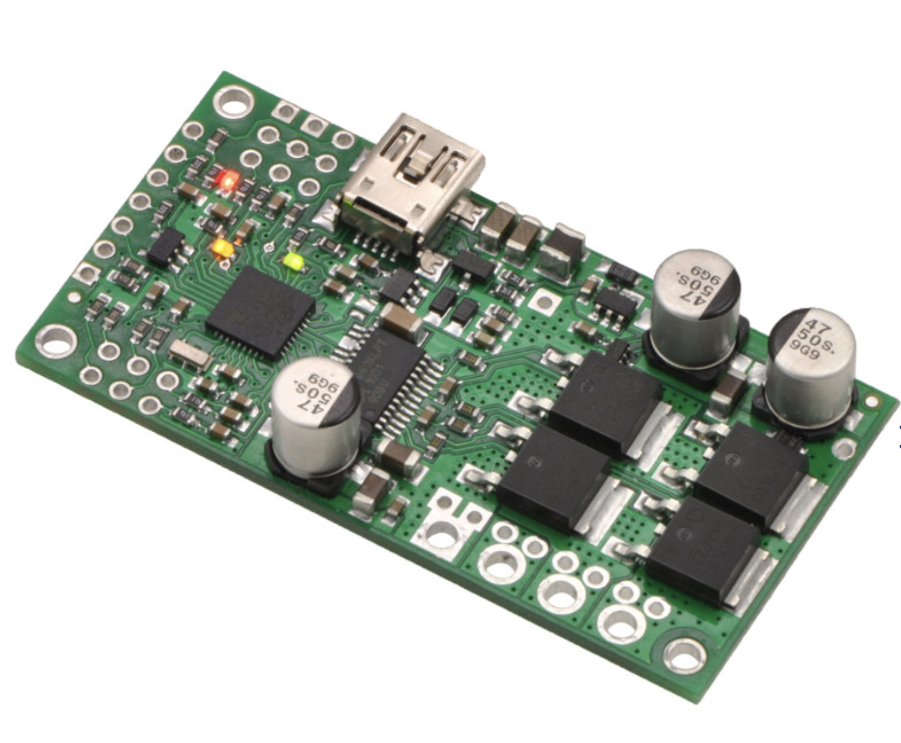
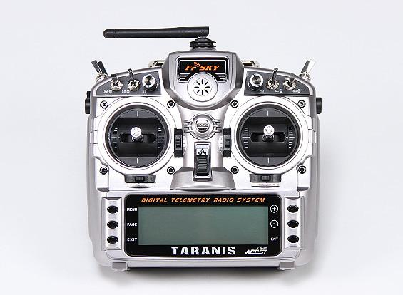
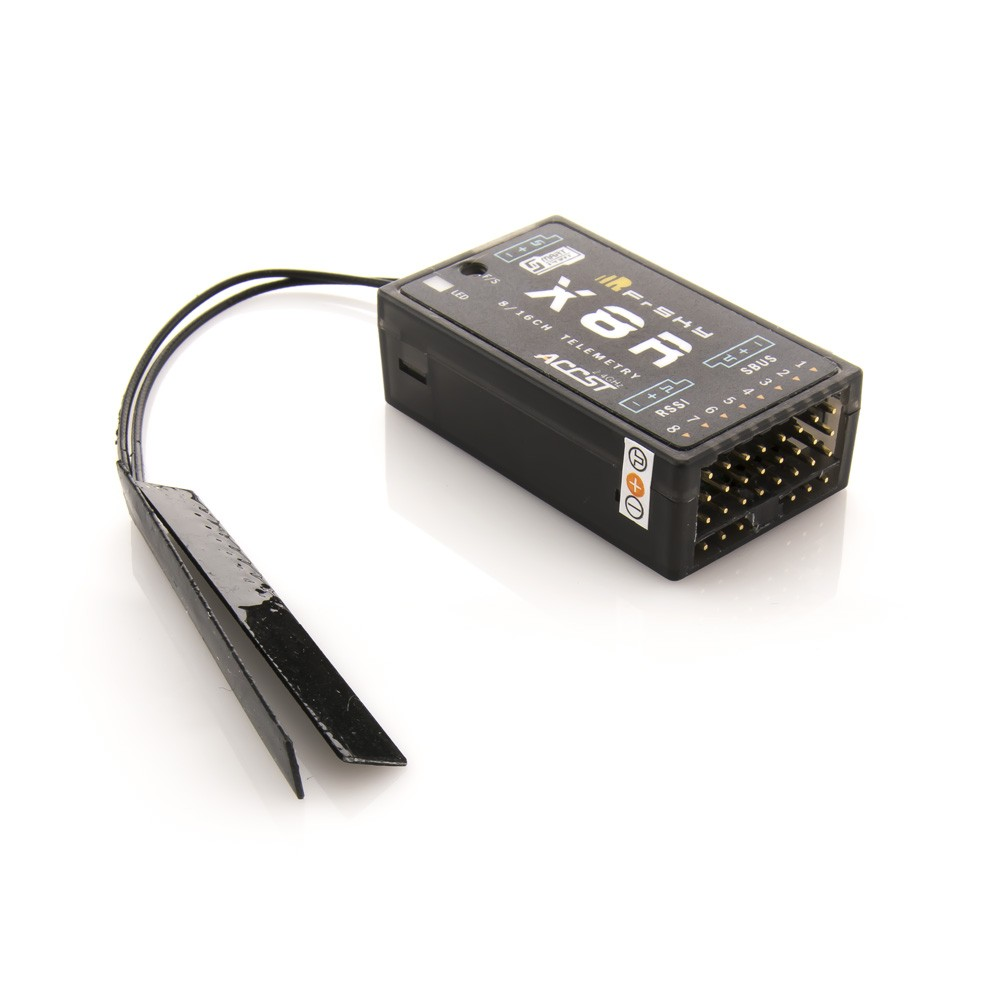
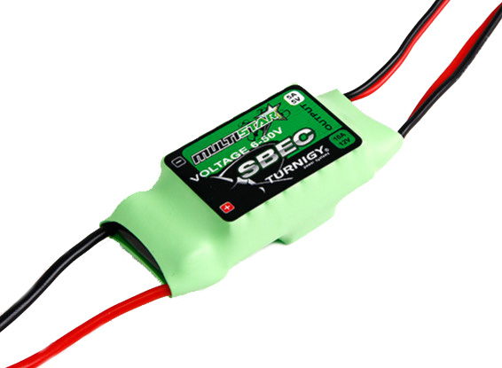
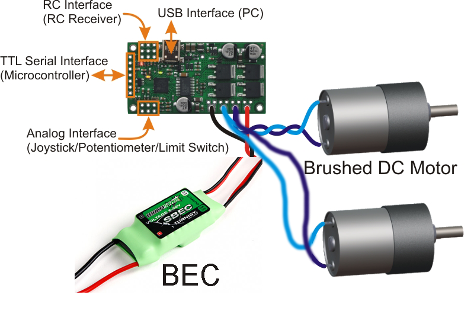
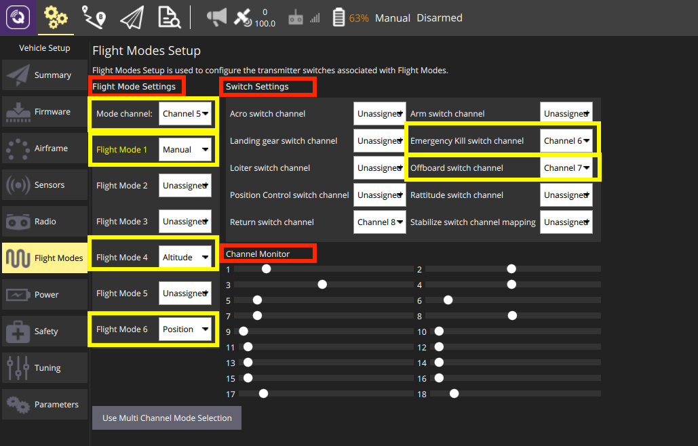
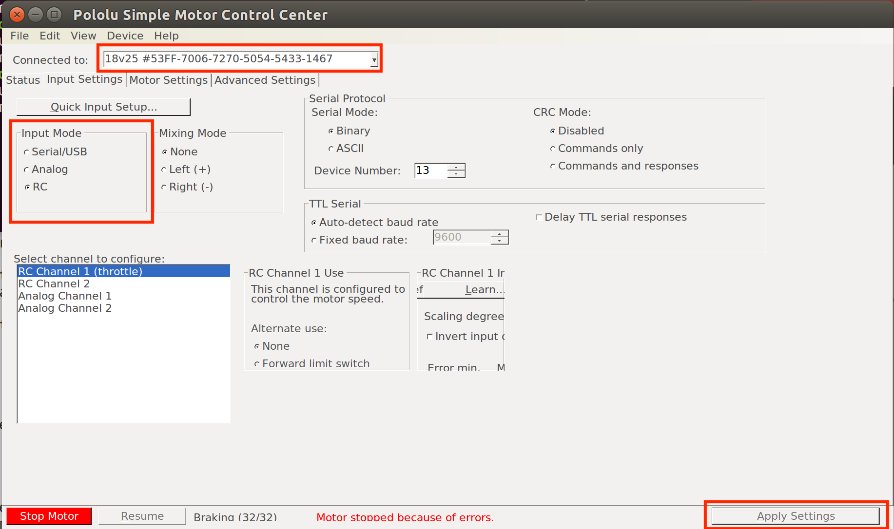

Rover Assembly
=====

Basic principles
-----

This tutorial will guide you how to build a skid-steer rover. Skid-steer vehicles have the wheels mechanically locked in synchronization on each side, and where the left-side drive wheels can be driven independently of the right-side drive wheels.

While building the rover, feel free to place the components anywhere inside the frame but take care of wires. Carefully choose zipties, shrinking tubes, double sided tapes or soldering for different situations.

Preliminaries
------

This tutorial assumes you have the following skills:

* :doc:`1-ros-basics`.

* Soldering, if not, please refer to basic skill `video <https://youtu.be/Qps9woUGkvI>`_.

* Basic knowledge about LiPo batteries. Answer the following questions. You may read `this article <https://rogershobbycenter.com/lipoguide/>`_. 

  - What do 3s, 4s mean?
  - What does 20c mean?
  - What does 1400mAh mean?
  - What are the parameters of your battery?
  - How to charge LiPo battery? How to measure it voltage using battery meter?
  - What’s the minimum voltage to use a LiPo on the robot?

.. danger:: Do not leave your battery plugged in your robot for a long time and never discharge a LiPo battery below 3.4V per cell.

Hardware assembly
-----

Introduction
^^^^^

You will need

* Rover frame with four wheels and DC motors.

* Two **motor controllers** to control DC motors.

 
* Flight Controller. Use any flight controller available in the lab. Just make sure you have compatible power modules, receivers, GPS, and other additional modules. The documentations for each board are available `here <https://docs.px4.io/en/flight_controller/pixhawk_series.html>`_.

* Remote control system. A remote control (RC) radio system is required if you want to manually control your vehicle. In addition to the transmitter/receiver pairs being compatible, the receiver must also be compatible with PX4 and the flight controller hardware. It's recommended to use **Taranis X9D Plus transmitter with X8R receiver** as shown below

* UBEC (Universal Battery eliminator circuit) to convert voltage to power Odroid. A BEC is basically a step down voltage regulator. It will take your main battery voltage (e.g. 11.1 Volts) and reduce it down to 5/12 Volts to safely power your Odroid and other electronics. We will use Twin Output BEC which will power Odroid and Motor controllers at the same time.

* Power module. It is the best way to provide power for flight controller unit. It has voltage and current sensors that allows autopilot to estimate remaining battery charge precisely. Usually it comes with every autopilot controller as a default kit. Check official documentations to match right power module to a selected flight controller.

.. image:: ../_static/power_module.jpg
   :scale: 60 %
   :align: center

* LiPo battery. 3000/4000 mAh 3S battery is recommended.

.. image:: ../_static/lipo.jpg
   :scale: 60 %
   :align: center

* Odroid XU4. Onboard computer that will run high level programs and algorithms. It will be connected to Flight Controller through serial connection. Odroid will need `WiFi USB module <https://www.hardkernel.com/product-category/connectivity/>`_, `eMMC memory module <https://www.hardkernel.com/shop/32gb-emmc-module-xu4-linux/>`_ and `DC Plug Cable <https://www.hardkernel.com/shop/dc-plug-cable-assembly-5-5mm/>`_.

.. image:: ../_static/odroid.jpg
   :scale: 60 %
   :align: center

Assembly process
^^^^^

* Install DC motors to the frame if necessary. Attach the wheels to the motor shafts with provided screw sets.

* Attach flight controller on the frame. Take a look at your flight controller and make sure the arrow is pointing to the front. To mount the controller to the frame, use thick double side tape to damp the vibrations.

* Connect right side motor's red cable to **OUTB**, and yellow cable to to the **OUTA** of the first motor controller. The motor controller's **RC1** port should be connected to **MAIN1** PWM ouput channel. Make sure you match **SIGNAL**, **+** and **-**. Use `servo cable <https://www.sparkfun.com/products/8738>`_ for this connection.

* Connect left side motor's red cable to **OUTA**, and yellow cable to to the **OUTB** of the second motor controller. The motor controller's **RC1** port should be connected to **MAIN3** PWM ouput channel. Again match **SIGNAL**, **+** and **-**.

* Connect BEC's 12V positive and ground outputs to **VIN** and **GND** respectively. You have to connect both motor controllers. They will be powered from the same BEC. 

The following diagram shows the connection for one of the sides. **RC Interface (RC Receiver)** is used for connecting to flight controller. **USB Interface** is used for modifying settings on the motor controller and flashing firmware.

* Install power module on the frame. Plug cable from power module to ``POWER`` port of your flight controller.

* Plug buzzer and switch to their corresponding ports on flight controller.

* Connect the ``RCIN`` port from Pixhawk to ``SBUS`` port on **X8R** and follow the binding process for FrSky X8R.

    * Turn on the **X8R** while holding the **F/S** button on the module. Release the button.
    * Press the **Menu** button on your Taranis X9D transmitter.
    * Go to page 2 by pressing **Page** button.
    * Scroll down with **-** button until you see **Internal RF** line.
    * Select **[Bind]** line, and press **ENT** button. The RED LED on the X8R receiver will flash, indicating the binding process is completed

Calibration process
-----

* Open **QGroundControl**  and connect your flight controller to the computer.

* `Install Stable PX4 firmware <https://docs.px4.io/en/config/firmware.html>`_.

* Set the airframe to Axial Racing AX10. Follow steps from this `page <https://docs.px4.io/en/config/airframe.html>`_.

* Calibrate `Compass <https://docs.px4.io/en/config/compass.html>`_, `Accelerometer <https://docs.px4.io/en/config/accelerometer.html>`_, and `Level Horizon <https://docs.px4.io/en/config/level_horizon_calibration.html>`_.

* Calibrate the `Radio <https://docs.px4.io/en/config/radio.html#performing-the-calibration>`_.

* In ``Flight Modes`` tab under the **Flight Mode Settings** and **Switch settings** sections set:

  - **Mode Channel** to SB (SB switch labeled on your Taranis X9D)
  - **Mode 1: Manual**. 
  - **Mode 4: Altitude**. Climb and drop are controlled to have a maximum rate.
  - **Mode 6: Position**. When sticks are released the vehicle will stop and hold position.
  - **Emergency Kill switch channel** to SF (SF switch labeled on your Taranis X9D). Immediately stops all motor outputs. The vehicle will crash, which may in some circumstances be more desirable than allowing it to continue flying.
  - **Offboard switch channel** to SA (SA switch labeled on your Taranis X9D).

You should have similar as shown in the picture below. Channels for **Flight Mode Settings** and **Switch Settings** might differ.

.. hint::
  
  If you set everything right, you will see changes in **Flight Mode Settings** section highlighted as yellow. Also, moving sticks, dials and switches will be reported in **Channel Monitor** section.

* In ``Power tab`` write the parameters of your battery (Number of cells), calibrate the battery voltage.

  * Press **Calculate** on the **Voltage divider** line.

  * Measure the voltage with Digital Battery Capacity Checker by connecting it to the battery.

  * Enter the the voltage value from the Digital Battery Capacity Checker and press **Calculate** button.

* Search for ``FW_ARSP_MODE`` in QGroundControl parameters, and set it to **Airspeed disabled**.

* Search for ``PWM_MAX`` and ``PWM_MIN`` and set them to **2200** and **800** respectively.

Configuring the motor controller
------

Download `Simple Motor Controller Linux Software <https://www.pololu.com/file/0J411/smclinux-101119.tar.gz>`_ on the Ubuntu based computer. Open terminal and navigate to the downloaded folder, and unzip the archive with the following command.

.. code-block:: bash

	tar -xzvf smc-linux-101119.tar.gz #File name might differ

After following the instructions in **README.txt** , you can run the program by following command.

.. code-block:: bash

	./SmcCenter

Connect motor controller to the Ubuntu based computer using mini USB cable. Navigate to **Input Settings** tab and change **Input Mode** to **RC** as shown below. After that press **Apply Settings**.

Driving the rover with the transmitter
------

* Make sure you switch **Kill switch** to off. Select **Manual** as your flight mode.

* Check the battery level, make sure it's enough to perform your first ride.

* Put the rover in the cage and do what??

.. important::
  
  Always check the battery before starting

Odroid installation
------

- Mount and attach Odroid XU4 on the rover. Connect WiFi module to the Odroid.

- To power the Odroid we need to provide 5V power to it. Solder `Odroid DC Plug Cable <https://www.hardkernel.com/shop/dc-plug-cable-assembly-5-5mm/>`_ to `female servo cable <https://www.sparkfun.com/products/8738>`_ and connect to the UBEC 5V output cable

- Next we need to connect Odroid to the flight controller using serial connection. In case of MindPX simply connect micro-USB cable to ``USB/OBC`` from the Odroid USB port. In case of Pixhawk use `FTDI module <https://www.ftdichip.com/Support/Documents/DataSheets/Cables/DS_TTL-232R_PCB.pdf>`_. Use `servo cable <https://www.sparkfun.com/products/8738>`_ to solder three wires to ``GND``, ``TX``, and ``RX`` (refer to page 8 of the FTDI datasheet file). After that solder these three wires to corresponding **TELEM2** port cable. Note that ``GND`` connects to ``GND``, ``RX`` to ``TX``, and ``TX`` to ``RX``.

- Plug in the DC power cable to the Odroid and check if it's powered

Contributors
-----

`Mohammad Albeaik <https://github.com/Mohammad-Albeaik>`_ and `Kuat Telegenov <https://github.com/telegek>`_.