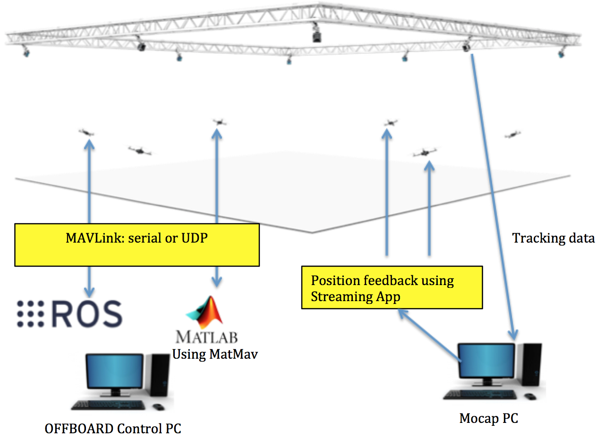

System Architecture
=========

Intro
----

This setup guide is mainly dedicated for the following experimental setups. The list will be updated when needed. Quadrotor indoor control using Pixhawk as a flight controller, and OptiTrack as motion capture system, for position and orientation feedback.

This section describes the overall system architecture. Each component will be briefly discussed.

The overall systems has 3 main elements:

* Motion capture system (OptiTrack)
* Object to be tracker
* Controller

Let's discuss each element in details

Motion capture system
-----

Motion capture (or ``mocap`` in brief) is used to provide high precision indoor local positions and orientation estimation of tracked objects. This is done using overhead cameras. The number of the objects the mocap system can track depends mainly on the camera types. At the time of writing this guide, RISC lab uses 20 Prime17w camera that are installed in the flying arena.
  
Objects are tracked by mounting retroflective markers on them that are rigidly attached.
  
Elements of ``mocap``:

* Tracking cameras (Prime17w)
* Network switches, to connect the cameras
* Mocap PC which runs the ``mocap`` software, Motive, that provides the tracking features.
  
Object to be tracked e.g. quadrotors, ground vehicles.
------

Objects are considered rigid bodies in the ``mocap`` system. They can be stationary or moving. There are 2 main types of information a rigid body (object) has in the ``mocap``: position and orientation. Position is in meters. Orientation are ``quaternion`` and can be converted to ``Euler`` angles, in radians.

``mocap`` setup is discussed in `here <http://risc.readthedocs.io/en/latest/2-2.html>`_.

Controller
-----

Controllers are PCs or single board computer (SBC) which are used to control the objects in the flying arena. When a PC is used to control an object, this referred as OFFBOARD control. Also a controller can be a flight controller that runs an autopilot firmware to control a vehicle (e.g. quadrotor).

A companion computer is referred to an SBC that is connected to a flight controller. Usually, SBC is used to perform more sophisticated/high computations that the flight controller can not. In other words, the flight controller is designed for low-level tasks e.g. attitude control, motor driving, sensor data acquisition. However, the companion computer is used for high-level-control e.g. path planning, optimization.
  
In this guide, a special attention is given to the use of `Pixhawk flight controller <http://risc.readthedocs.io/en/latest/2-3.html>`_  and  `ODROID <http://risc.readthedocs.io/en/latest/2-6.html>`_ SBC, as a companion computer.