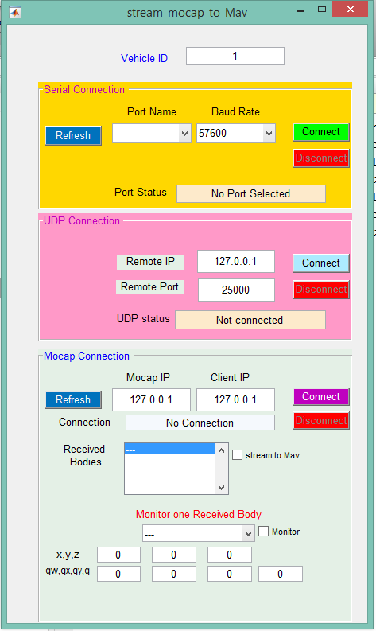

Motion Capture Setup: Optitrack
=========

Intro
-----

The setup of the *OptiTrack* ``mocap`` includes:

* Camera setup (Prime17w)
* System calibration
* Software, *Motive*, setup (e.g. creating rigid bodies)

Next, we learn how to stream the position/orientation information of the objects (rigid bodies) to the *Pixhawk* for feedback. This is done using the custom-made streaming application, called ``OptiStream``.

Camera calibration
-----

Make sure that you remove any markers from the captured area before performing calibration.

Make sure that you use clean markers on the wanding stick.

The calibration involves three main steps

* Sample collections using the wanding stick
* Ground setting using the L-shape tool
* Ground refinement

Follow `this guide <http://wiki.optitrack.com/index.php?title=Calibration>`_ in order to perform the calibration.

.. note::

	It is recommended to perform camera calibration on weekly basis, or every couple of weeks.

Calibration video:

.. raw:: html 
	
	<iframe width="560" height="315" src="https://www.youtube.com/embed/cNZaFEghTBU?rel=0" frameborder="0" allow="autoplay; encrypted-media" allowfullscreen></iframe>

Motive setup
-----

In this section, we mainly want to learn how to 

* Create rigid bodies that represent objects to be tracked (e.g. quadrotor)
* Activate the streaming of rigid bodies information (e.g. position orientation)

Make sure that you have clean markers. Markers should not be placed in symmetric shape. Markers should not be close to each other.

Read `this guide <http://wiki.optitrack.com/index.php?title=Markers>`_ for markers setup.

Follow `this guide <http://wiki.optitrack.com/index.php?title=Rigid_Body_Tracking>`_ to create rigid bodies.

Setup streaming application (deprecated)
-----

In this section, we learn how to install and use the streaming application, *OptiStream*. *OptiStream* is used to receive rigid bodies information (i.e. position & orientation), and stream them to the desired *Pixhawk*.

Requirements:

* *OptiStream* Windows Application.

.. note::

	To obtain OptiStream, contact matmav.toolbox@gmail.com 

