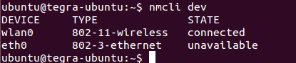

DJI Manifold initial setup
=======

If you follow official DJI User Manual for DJI Manifold you may encounter few problems. This guide will solve them and install all neccessary packages.

Enter recovery mode
-----

Follow DJI User Manual to enter the Recover mode on DJI Manifold. Method 1 should work fine.

Restore the Manifold to default settings
-----

.. code-block:: bash

    cd
    mkdir manifold
    cd manifold
    wget https://dl.djicdn.com/downloads/manifold/manifold_image_v1.0.tar.gz
    tar -xvpzf manifold_image_v1.0.tar.gz
    cd Linux_for_Tegra
    sudo ./flash.sh jetson-tk1 mmcblk0p1

Compiling and installing kernel
-----

Power on the Manifold and connect it to a monitor and a keyboard.

On Manifold download kernel by following commands

.. code-block:: bash

    cd
    mkdir ~/kernel
    cd kernel
    wget https://dl.djicdn.com/downloads/manifold/manifold_kernel_source_v1.0.tar.gz
    tar xvzf manifold_kernel_source_v1.0.tar.gz
    cd linux_3.10
    cp arch/arm/configs/manifold_config .config
    make menufconfig

Press ESC button two times once the graphical menu will popup.

Execute to compile kernel

.. code-block:: bash

    sudo make

You might get different errors here, mainly because of low memory. Keep executing previous command until you see it successfully done.

Next install kernel and modules

.. code-block:: bash

    sudo make modules
    sudo make modules_install
    sudo cp /boot/zImage /boot/zImage.bak
    sudo cp arch/arm/boot/zImage /boot/
    sudo cp arch/arm/boot/dts/tegra124-jetson_tk1-pm375-000-c00-00.dt* /boot/

After this reboot Manifold

.. code-block:: bash

    sudo reboot

Cuda and OpenCV4Tegra
-----

.. code-block:: bash

    cd
    wget http://developer.download.nvidia.com/embedded/L4T/r21_Release_v3.0/cuda-repo-l4t-r21.3-6-5-prod_6.5-42_armhf.deb
    sudo dpkg -i cuda-repo-l4t-r21.3-6-5-prod_6.5-42_armhf.deb
    sudo apt-get update
    sudo apt-get install cuda-toolkit-6-5

.. code-block:: bash

    cd
    wget developer.download.nvidia.com/embedded/OpenCV/L4T_21.2/libopencv4tegra-repo_l4t-r21_2.4.10.1_armhf.deb
    sudo dpkg -i libopencv4tegra-repo_l4t-r21_2.4.10.1_armhf.deb
    sudo apt-get update
    sudo apt-get install libopencv4tegra libopencv4tegra-dev libopencv4tegra-python

ROS Indigo
-----

Install ROS Bare Bones version from here.

http://wiki.ros.org/indigo/Installation/UbuntuARM

Enable WiFi with USB
-----

Currently I was able to make it work with this module - https://www.hardkernel.com/shop/wifi-module-3/. 

It's a 2.4GHz module, so 2.4GHz needs to be enabled on the router. 

Install the software needed by following commands

.. code-block:: bash

    sudo apt-get install linux-firmware
    cd
    wget https://elinux.org/images/a/a8/Rtl8192cufw.bin.zip
    unzip Rtl8192cufw.bin.zip
    sudo cp rtl8192cufw.bin /lib/firmware/rtlwifi

Reboot Manifold

.. code-block:: bash

    sudo reboot

Try this command and see if you can observe the wlan0

.. code-block:: bash

    nmcli dev

References
-----

1. https://dl.djicdn.com/downloads/manifold/20170918/Manifold_User_Manual_v1.2_EN.pdf
2. https://elinux.org/Jetson/Network_Adapters

Contributors
-----

Contributor is `Kuat Telegenov <https://github.com/telegek>`_.