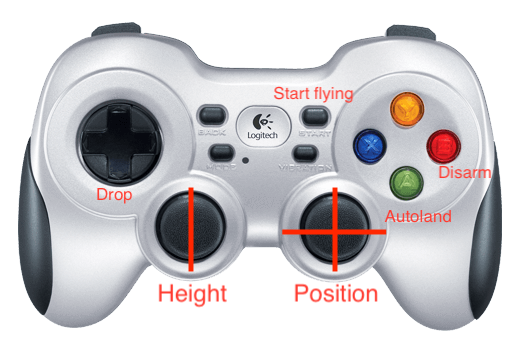

Pick and drop demo
*****

Pick and Drop is a demonstration of object transportation using a drone in an indoor setup. The control can be either via a human pilot who controls the drone using a joystick to fly the drone, pick, transport and drop the object, or fully autonomous using vision feedback.

The following setup is assumed.

- Indoor localization system (optitrack)
- A drone that is equipped with a PX4 autopilot and an arduino-controlled customized gripper.
- An object that is magnetic (can be picked by a permanent magnet)
- A ROS-compatible joystick for manual control
- A ROS-compatible camera for vision feedback, for autonomous mission
- ROS Kinetic, Ubuntu 16 on ODROID XU4, or a similar onboard computer

Dependencies
======

- `vprn_client_ros <http://wiki.ros.org/vrpn_client_ros>`_
- `apriltag2_ros <https://github.com/dmalyuta/apriltags2_ros>`_
- `cv_bridge <http://wiki.ros.org/cv_bridge>`_
- `rosserial <http://wiki.ros.org/rosserial>`_

Installation
======
- Make sure you install the required dependencies above
- Clone `this package <https://github.com/risckaust/pick_drop_demo.git>`_ into your ~/catkin_ws/src and build it
- The arduino code that controls the gripper is in the `gripper_joystick <https://github.com/risckaust/pick_drop_demo/tree/master/gripper_joystick>`_ folder.

Experiment
======

- Place markers rigidly on the drone, and define a rigid body in Motive
- Stream the rigid body info using VRPN, and make sure that Up axis is the z-axis
- It is assumed that you have an onboard computer which runs mavros, which can be used to feed the rigidbody pose from motion capture information to PX4.

.. note:: 
    
    Always double check that you can hover the drone in **POSITION** flight mode, before you execute the experiments in **OFFBOARD** mode.

Manual control (Drone 1)
=====

- Make sure that you give the joystick permissions (we used `Logitech F710 <https://www.logitechg.com/en-us/products/gamepads/f710-wireless-gamepad.html>`_). 

.. code-block:: bash

    sudo chmod a+rw /dev/input/js0 # Check the input device number

- The right analog stick is for x/y (position) motion. The left stick is for height. The red button is for disarm. The green button is for autoland. The down button on D-Pad is for dropping, if the object is picked (detected by the button on the gripper).

- Run the following command on the onboard computer. Double check the addresses for joystick, arduino, FCU, Ground Contorl Station, and name of the Rigid Body from Mocap system.

.. code-block:: bash

    roslaunch pick_drop_demo start_manual_test.launch

Autonomous mission (Drone 2)
======

- Run the following command on the onboard computer. Double check the addresses for arduino, FCU, Ground Contorl Station, and name of the Rigid Body from Mocap system.

.. code-block:: bash

    roslaunch pick_drop_demo start_autonomous_mission.launch

Contributors
======

Main contributors are `Asmaa AlSaggaf <https://github.com/aumsaggaf/>`_ and `Mohamed Abdelkader <https://github.com/mzahana>`_.