Setting Up a ROS network: WiFi + Ethernet
========

Introduction
-----
In some applications, it might be necessary to have, not one, but multiple computers connected via an Ethernet cable, and then the bunch of them connected to a remote WiFi router. This situation arose during ERL 2019 competition. I wanted to have two computers on the drone connected via an Ethernet cable, and I wanted to be able to communicate with the onboard computers via WiFi.

Why did I need two computers, you ask? One computer, the Jetson TX2, had good performance in object detection tasks because it had a GPU, and GPUs greatly enhance the speed of neural networks which are used in object detection. The other computer, the Intel NUC, had good integration with the RealSense camera which is the de facto officially supported camera for the PX4 obstacle avoidance ROS package. The idea is to have the best of both worlds by having them both on the drone. This requires setting up a network.
Note that these two computers are on the drone, so it makes sense to establish a wired network between them to ensure stability of the connection, and this is why an Ethernet cable is used.

In order to communicate with the onboard computers from the ground control station (laptop), a WiFi router is used. It is desirable to be able to ping any of the devices from both networks to any other device from either network. It is also required to be able to view ROS topics on the master (in my case, the Intel NUC) from the other PCs (Jetson TX2, and ground control station).

Establishing the network described above seems like a straightforward task. However, it is not as easy as it seems. After a lot of trial and error, I am presenting one possible way of establishing this network. This may not be the best approach, but this is what worked out for me. One more note: the networking procedure described here is not specific to the hardware used. The same procedure can be followed on other hardware to achieve the desired functionality.

Hardware used
-----
- Jetson TX2
- Intel NUC
- Laptop
- Ethernet cable

Software used
-----

Ubuntu 16.04 on all devices

Desired functionality
-----

- Ping any of the devices from both networks to any other device from either network
- View ROS topics on the master from all other PCs

Network Diagram
-----

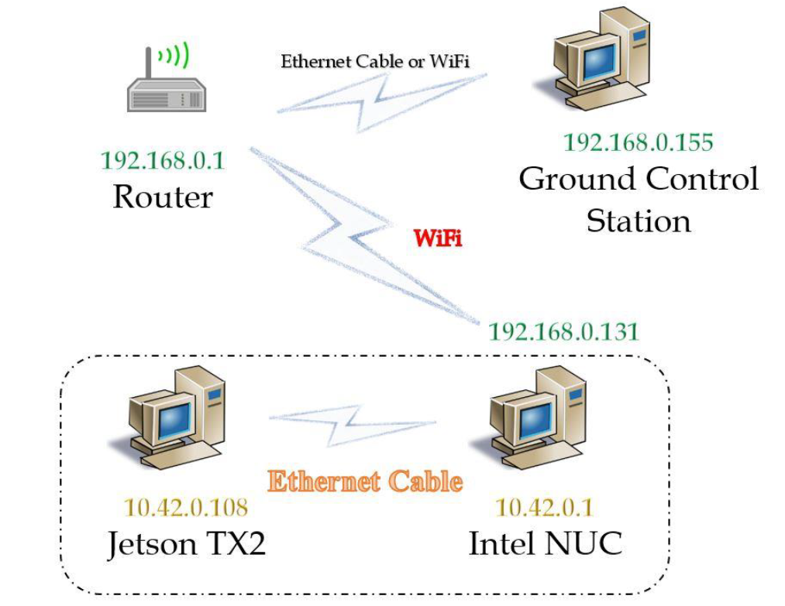

Setting the network
-----
Connect Intel NUC and Jetson TX2 with an Ethernet cable. Make sure both PCs are on. Disable WiFi on Jetson TX2. Make sure Intel NUC is connected to the WiFi router. Try to ping Jetson TX2 from Intel NUC or vice versa. It fails. To make it work, follow the steps below:

On Intel NUC
^^^^^

- Click on Networking Symbol, and click on Edit Connections:

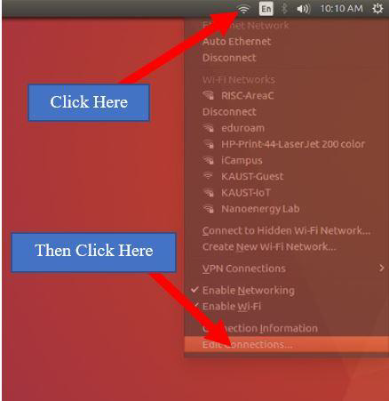

- After clicking Edit Connections, the following screen appears. Select the Ethernet connection, and click Edit.

.. image:: ../_static/nuc-1-2.png
   :scale: 50 %
   :align: center

- After clicking Edit, a window appears. Go to the IPv4 Settings Tab (shown in picture below)

.. image:: ../_static/nuc-1-3.png
   :scale: 50 %
   :align: center

- Change Method from Automatic (DHCP) to Shared to other computers as shown below:

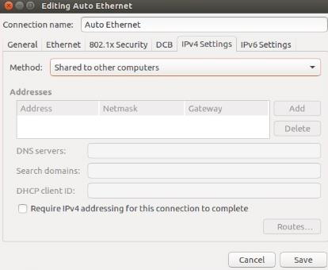

- Click Save.

- For the change in step 5 to take effect, click on Auto Ethernet (or whatever it is you called your ethernet connection) from the drop-down menu shown below:

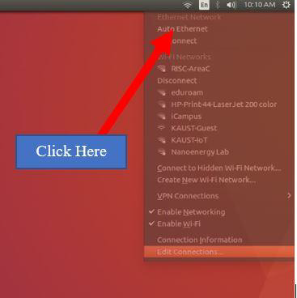

- To verify that you have followed the steps above correctly, show Connection Information (by clicking on it from the same drop-down menu shown in step 6). You should see the following. The IPv4 address is automatically set to 10.42.0.1.

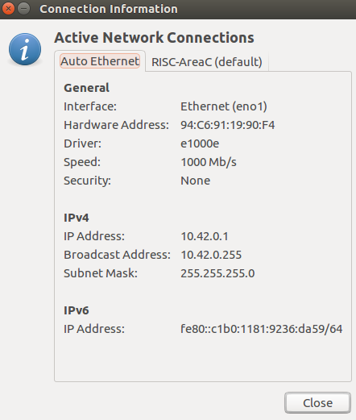

- I assume here that you have already configured your WiFi connection. Make sure you are connected to the WiFi router. In my case, this is the WiFi connection information:

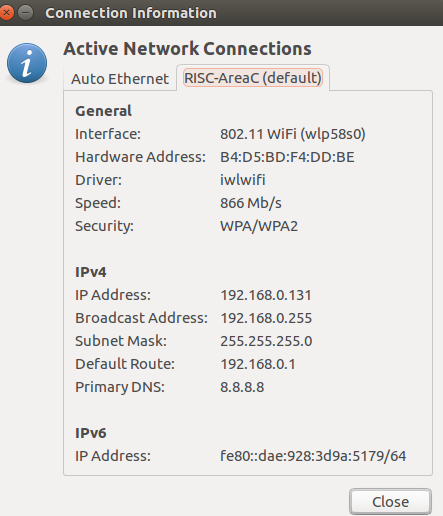

- Compare the screenshots in steps 7 and 8 with the networking diagram shown earlier to gain a better understanding of what is going on.

- Enable IPv4 forwarding

    * in ``/etc/sysctl.conf``, uncomment (or add) *net.ipv4.ip_forward=1*
    * or run following command in terminal ``sudo sysctl -w net.ipv4.ip_forward=1``
    * It’s a good idea to open ``/etc/sysctl.conf`` in a text editor of your choice to verify the changes were applied.

On Jetson TX2
^^^^^

Following similar steps as described for Intel NUC, configure the Ethernet connection IPv4 to Automatic (DHCP). Verify that you have succeeded by pinging the Jetson TX2 from the Intel NUC, and the other way around. Also, if your WiFi router is connected to the Internet, then you will also be able to access the internet from Jetson TX2. See screenshot below:

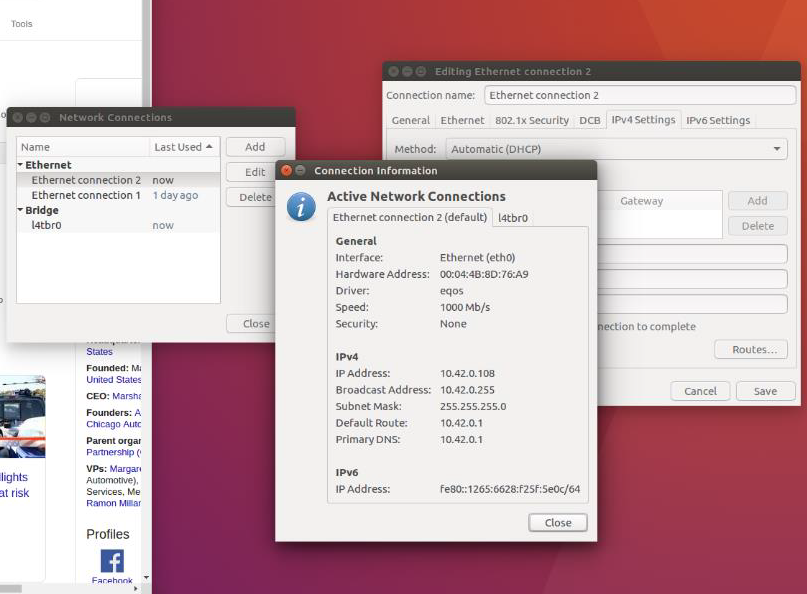

On Ground Control Station
^^^^^

- Add static route by executing following command

.. code-block:: bash

  sudo route add -net <inster_ip_of_wired_network> netmask 255.255.255.0 gw <inster_ip_of_wireless_port_of_Intel-NUC_or_similar>

- In my case, I run the following command:

.. code-block:: bash

  sudo route add -net 10.42.0.0 netmask 255.255.255.0 gw 192.168.0.131

- Ping Ground Control Station from Jetson TX2 and Intel NUC, and vice versa to verify things are working

.. note::

    Adding a static route is not a permanent change. You will have to do this every time you reboot.

The figure below shows the routing table on the Ground Control Station. Check out the second entry. This was added by following step 1. The command ``route -n`` can be used to verify you have added the static route correctly.

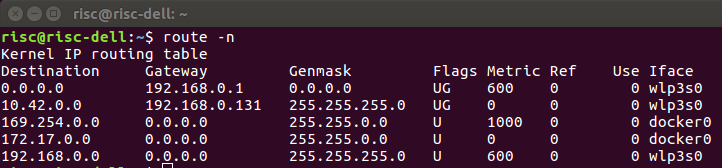

Useful Networking Commands
------

.. code-block:: bash

    ifconfig #shows network interfaces on device
    nmap -sP 192.168.0.0/24 #shows all other devices on the network 192.168.0.0/24
    nmap -sn 192.168.0.0/24 #same as above but does not do a port scan
    sudo apt-get install nmap #installs network scanner nmap
    arp -a #if you don’t want to install nmap, but from my experience arp -a does not always show all devices. On the other hand, nmap usually does.

ROS Communications
-----

This section aims to establish ROS communication across both networks (Wired and WiFi) so that PCs on both networks can view ROS Master topics

Intel NUC (ROS Master)
^^^^^

- Add the following exports to wherever you do your exports (in my case, they are in the ``~/.bashrc`` file

``export ROS_MASTER_URI=http://10.42.0.1:11311``

``export ROS_IP=10.42.0.1``

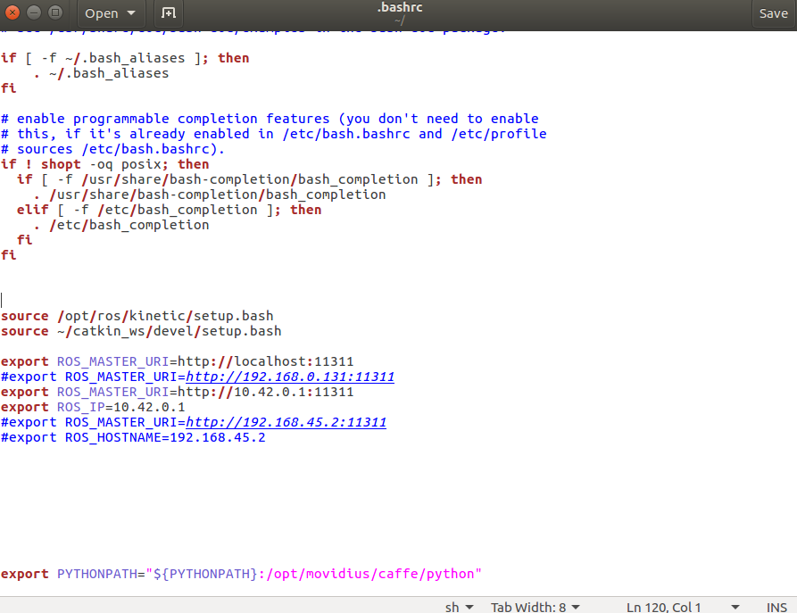

- Edit ``/etc/hosts`` with the hostnames and IP addresses of other devices. In my case, I have two other devices: Jetson TX2 with hostname ``tegra-ubuntu`` and Ground Control Station with hostname ``risc-dell``. The ``/etc/hosts`` looks like the following:

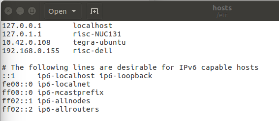

Jetson TX2
^^^^^

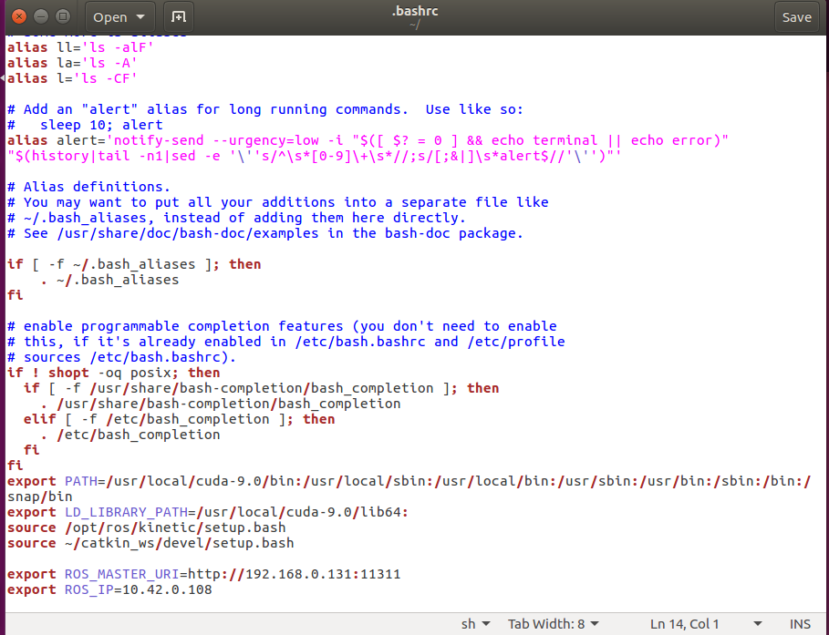

.. image:: ../_static/tx-2-2.png
   :scale: 50 %
   :align: center

Ground Control Station
^^^^^^

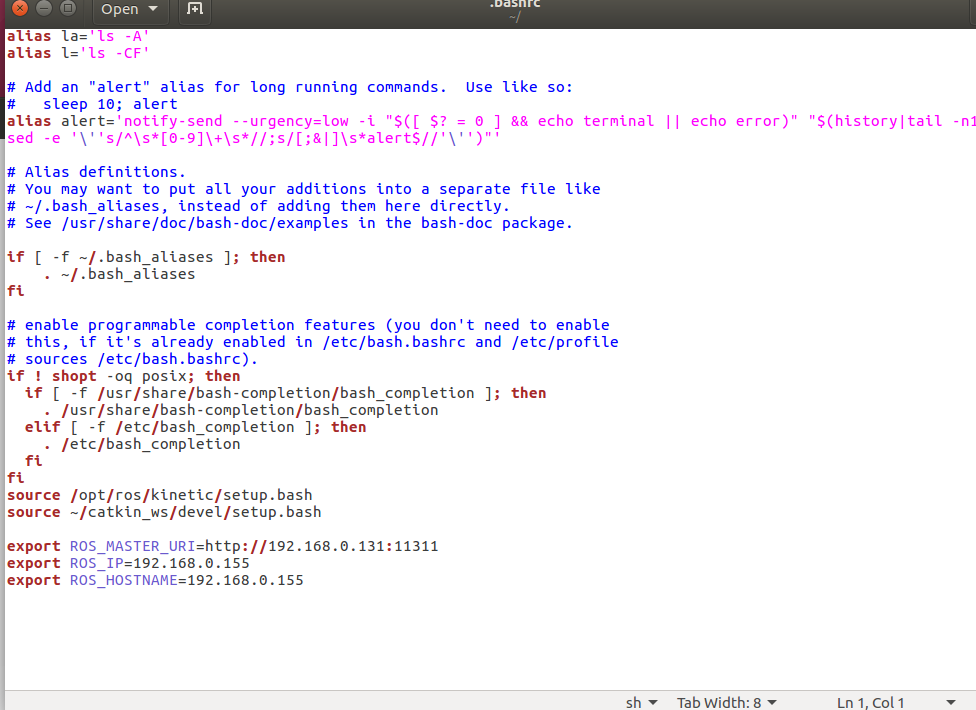

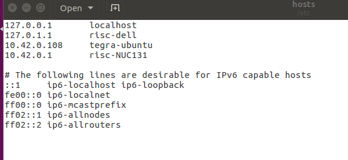

.. important::

    Don’t forget to source your ``.bashrc`` file after and if you edited it.

To verify that ROS communication is established, run anything on the ROS Master (Intel NUC) and see if you can list topics from other PCs. For example, run a ROS camera package, and try to view the video stream through rviz on other devices (Jetson TX2 and Ground Control Station). Note: currently, if you run a ROS package on Jetson TX2 (Not the ROS master), you will be able to view the topics from the Ground Control Station, but not their contents.

What if you want to launch a file from Ground Control Station, and you want to be able to select which machine to run this node. Look no more. The answer is here:

http://wiki.ros.org/roslaunch/XML/machine

References
-----

None of which I strictly followed. I just got inspiration from these references in establishing the network and in writing this document. Things got working by trial and error and luck.

https://risc.readthedocs.io/2-networking.html

https://github.com/ethz-asl/mav_dji_ros_interface/wiki/NVIDIA-Jetson-TX2-integration

Some Good Textbooks about Networking (first book = linux networking, second book = networking in general)

http://linux-training.be/linuxnet.pdf

http://iips.icci.edu.iq/images/exam/Computer-Networks---A-Tanenbaum---5th-edition.pdf

Contributors
-----

Main contributor is Tarek H. Mahmoud.
