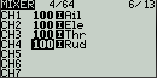

Taranis + DJI Naza/N3
==========

Introduction
--------------------------------------------
This tutorial explains how to setup Taranis transmitter with DJI Naza/N3 flight controllers. The setup was tested with Taranis X7Q, DJI Naza-M v2, and FrSky D4R-II receiver. Also, should work with any FrSky receiver, Taranis transmitter, and DJI flight controllers.

Binding process
-------

Please follow the official instructions from FrSky website to bind receiver with transmitter. On the transmitter, set **Internal RF** mode to **D8** if using D4R-II and **D16** if using X8R.

Setup
------
In the menu of the Taranix X7Q transmitter go the **MIXER** page and change it to match following picture.

Contributors
-------

Main contributor is Kuat Telegenov

