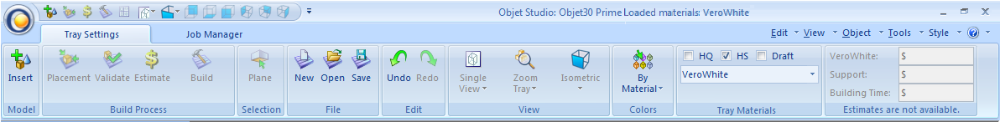
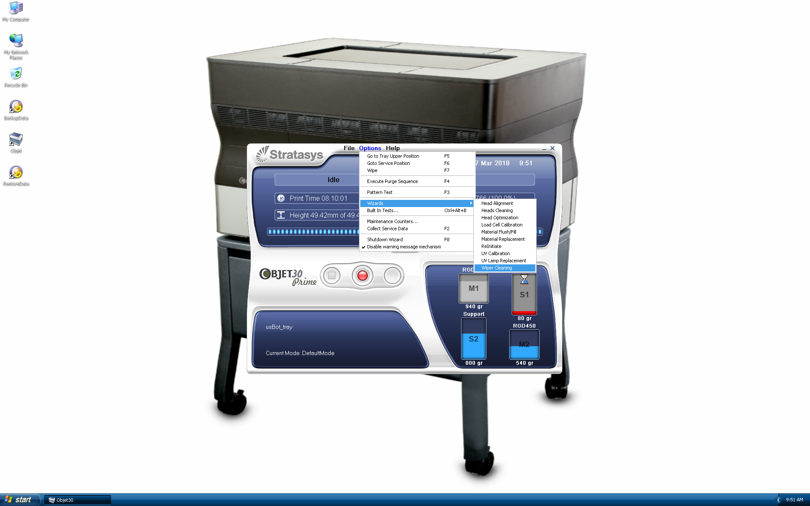

3D Printing
=====

Objet30 Prime
-----

- Open Objet Studio application from Desktop
- Click **Insert** from Tray Settings tab to place an object on the build tray. In Insert dialog box, choose your STL file and units of your file.

- Click **Placement** to automatically arrange objects on the build tray
- Click **Validate** to check that the tray is “valid” and can be printed.
- Click **Estimate** to calculate the time and material resources needed for producing trays before sending them to the printer
- Click **Build** to start printing

After each printing
^^^^^^^

Cleaning the print heads and the roller
""""""""""""

To maintain the Objet30 printer in optimum condition, clean the print heads after every print job, when you remove the model from the build tray.

- Start the **Head Cleaning** Wizard from the Options menu

.. image:: ../_static/heads_cleaning.png
   :scale: 50 %
   :align: center

- Follow the instructions on the wizard screens, and select the confirmation check boxes, click Next.
- When the screen with **Clean Printer Components** appears, open the cover

.. warning::

    The print head orifice plates (bottom surface) may be hot. Do not touch them with your bare hands, and proceed with caution.

- Place the mirror on the build tray
- Put on the gloves
- Soak the cleaning cloth with alcohol
- Clean the orifice plates, with a back-and-forth motion. Use the mirror to make sure that you have removed all of the residue material
- Clean the entire roller surface, by rotating it as you clean
- When you have finished cleaning, select the confirmation check boxes in the wizard screen and click Next
- Remove the cleaning materials and mirror from the printer and close the cover
- Select the confirmation check boxes in the wizard screen and click Next. The head-purge cycle begins. When this is complete, the final wizard screen appears.
- Click Done to close the wizard

Cleaning the wiper
""""""""

A rubber wiper removes excess material from the print heads after the purge sequence. This is done automatically before each print job. You should clean the wiper and surrounding area.

- Start the **Wiper Cleaning** wizard from the Options menu.

- Make sure that the build tray is empty, and close the printer cover. Confirm this in the wizard screen and click Next
- When the next screen appears, open the cover
- Put on the cleaning gloves
- Using a generous amount of alcohol on the cleaning cloth, remove any material remaining on the wiper and the surrounding area
- In the wizard screen, confirm that the wiper blade is clean, and click Next
- Remove all tools and cleaning materials from the printer, and close the cover. Confirm this in the wizard screen, and click Next
- Click Done to close the wizard

..note::

    The routine maintenance tasks are performed only by lab engineer. You may refer to Objet30 user guide document for more detailed instructions.

Ultimaker3 Extended
-----

.. image:: ../_static/ultimaker.png
   :scale: 20 %
   :align: center

How to Print

- Install `Cura software <https://ultimaker.com/en/products/ultimaker-cura-software/list>`_ (Windows, Linux and OSX are supported) or use it on the iMac in Area A.
- Save your 3D model as a STL file from your Computer-aided design (CAD) software.
- Open STL(s) files in the Cura software.

