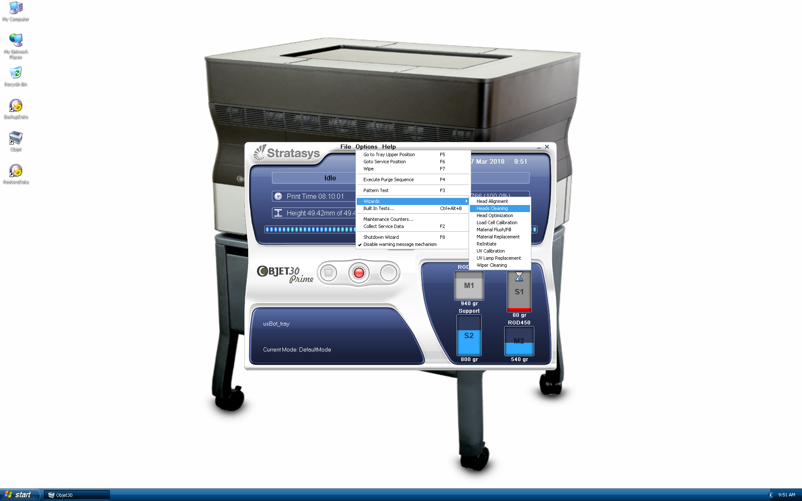
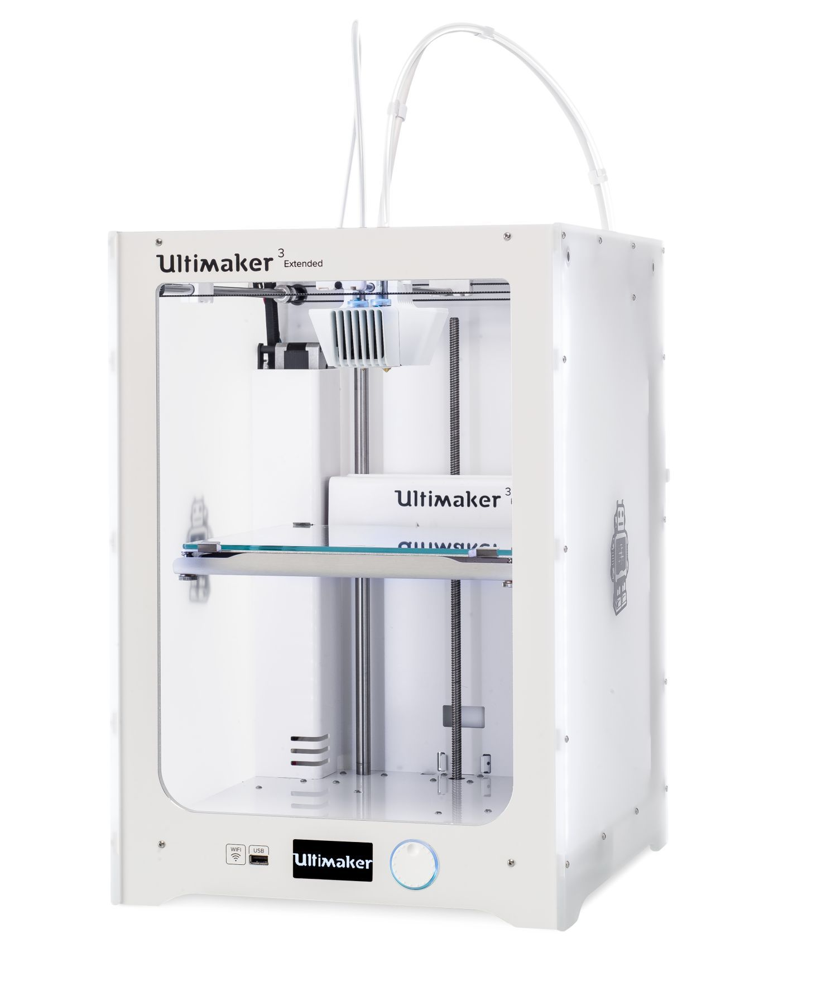

3D Printing
=====

Objet30 Prime
-----

.. image:: ../_static/objet.jpg
   :scale: 70 %
   :align: center

- Use HP station in Area B.

After each printing
^^^^^^^

Cleaning the print heads and the roller
""""""""""""

To maintain the Objet30 printer in optimum condition, clean the print heads after every print job, when you remove the model from the build tray.

- Start the **Head Cleaning** Wizard from the Options menu

- Follow the instructions on the wizard screens, and select the confirmation check boxes, click Next.
- When the screen with **Clean Printer Components** appears, open the cover

.. warning::

    The print head orifice plates (bottom surface) may be hot. Do not touch them with your bare hands, and proceed with caution.

- Place the mirror on the build tray
- Put on the gloves
- Soak the cleaning cloth with alcohol
- Clean the orifice plates, with a back-and-forth motion. Use the mirror to make sure that you have removed all of the residue material
- Clean the entire roller surface, by rotating it as you clean
- When you have finished cleaning, select the confirmation check boxes in the wizard screen and click Next
- Remove the cleaning materials and mirror from the printer and close the cover
- Select the confirmation check boxes in the wizard screen and click Next. The head-purge cycle begins. When this is complete, the final wizard screen appears.
- Click Done to close the wizard

Ultimaker3 Extended
-----

How to Print

- Install `Cura software <https://ultimaker.com/en/products/ultimaker-cura-software/list>`_ (Windows, Linux and OSX are supported) or use it on the iMac in Area A.
- Save your 3D model as a STL file from your Computer-aided design (CAD) software.
- Open STL(s) files in the Cura software.

