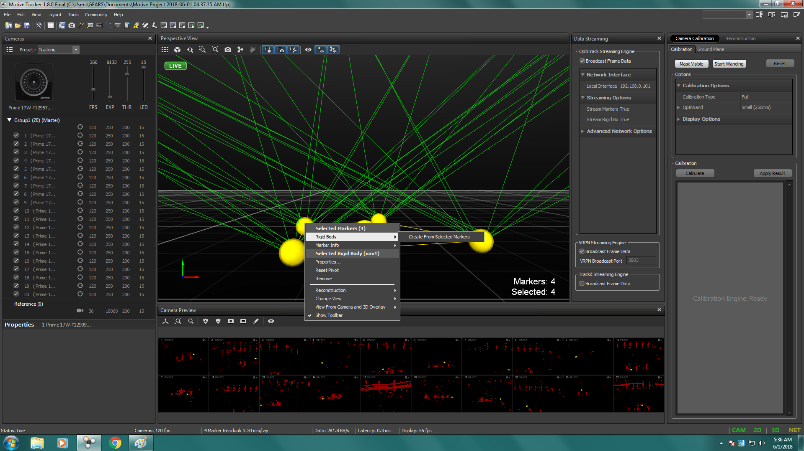

Indoor flying
*****

System Architecture
=========

In order to start flying the quadcopter indoor, we need the position and orientation feedback for this.

This section will guide you how to use OptiTrack Motion Capture System, how to stream position and orientation data to ROS, and feed it to your flight controller.

.. image:: ../_static/sys_arch2.png
   :scale: 50 %
   :align: center

There are two options to send high level commands to a flight controller. Using a stationary PC via WiFi or an on-board computer via telemetry port. The overall systems has following main elements:

* OptiTrack Motion Capture System
* Object to be tracker, eg. quadcopter, ground vehicles.
* Controller

Let's discuss each element in details

Motion capture system
-----

OptiTrack motion capture system (mocap hereinafter) works as follows. The overhead cameras send out pulsed infrared light using the attached infrared LEDs, which will then be reflected by markers on the object and detected by the OptiTrack cameras. Knowing the position of those markers in perspective of several cameras, the actual 3D position of the markers in the room can be calculated using triangulation. Simply mocap provides high precision indoor local position and orientation estimation. Position is meters and orientation is in quaternion, which can be converted Euler angles in radians. In RISC lab we use twenty Prime17w cameras that are installed in the flying arena.
    
All cameras are connected to a single Mocap PC through network switches. Motive Optical motion capture software is installed on this PC.
  
Controller
-----

Controllers are PCs or single board computer (SBC) which are used to control the objects in the flying arena. When a PC is used to control an object, this referred as OFFBOARD control. Also a controller can be a flight controller that runs an autopilot firmware to control a vehicle (e.g. quadcopter).

A companion computer is referred to an SBC that is connected to a flight controller. Usually, SBC is used to perform more sophisticated/high computations that the flight controller can not. In other words, the flight controller is designed for low-level tasks, e.g. attitude control, motor driving, sensor data acquisition. However, the companion computer is used for high-level-control e.g. path planning, optimization.
  

Motion Capture Setup: Optitrack
=========

Intro
-----

The setup of the *OptiTrack* ``mocap`` includes:

* Camera setup (Prime17w)
* System calibration
* Software, *Motive*, setup (e.g. creating rigid bodies)

Next, we learn how to stream the position/orientation information of the objects (rigid bodies) to the *Pixhawk* for feedback. This is done using the custom-made streaming application, called ``OptiStream``.

Camera calibration
-----

Make sure that you remove any markers from the captured area before performing calibration.

Make sure that you use clean markers on the wanding stick.

The calibration involves three main steps

* Sample collections using the wanding stick
* Ground setting using the L-shape tool
* Ground refinement

Follow `this guide <http://wiki.optitrack.com/index.php?title=Calibration>`_ in order to perform the calibration.

.. note::

	It is recommended to perform camera calibration on weekly basis, or every couple of weeks.

Calibration video:

.. raw:: html 
	
	<iframe width="560" height="315" src="https://www.youtube.com/embed/cNZaFEghTBU?rel=0" frameborder="0" allow="autoplay; encrypted-media" allowfullscreen></iframe>

Motive setup
-----

In this section, we mainly want to learn how to 

* Create rigid bodies that represent objects to be tracked (e.g. quadrotor)
* Activate the streaming of rigid bodies information (e.g. position orientation)

Make sure that you have clean markers. Markers should not be placed in symmetric shape. Markers should not be close to each other.

Read `this guide <http://wiki.optitrack.com/index.php?title=Markers>`_ for markers setup.

Follow `this guide <http://wiki.optitrack.com/index.php?title=Rigid_Body_Tracking>`_ to create rigid bodies.

OptiTrack Interface to ROS
=====

Intro
----

Getting positions of objects in the observable OptiTrack space to ROS works as follows. 

Required Hardware
----

* Mocap machine. Runs Motive Motion Capture Software.
* Optitrack Motion Capture System
* WiFi router (5GHz recommended)
* A linux based computer, normal PC or on-board embedded computer like ODROID XU4 will work. The linux computer should be connected to the router either via ethernet cable or WiFi connection.

.. note::

	It is recommended to use **static IP** for your linux machine, as below:

	IP: 192.168.0.xxx 

	Subnet Mask: 255.255.255.0

	Gateway: 192.168.0.1

	DNS Server: 8.8.8.8

Required Software
-----

* Motive. It allows you to calibrate your OptiTrack system, stream tracking information to external entities.

* ROS Kinetic installed on your Linux computer.

* `vrpn_client_ros <http://wiki.ros.org/vrpn_client_ros>`_ package for ROS to receive the tracking data from the Mocap computer.

Installation
-----

Method 1. PC
^^^^^

Install `vrpn_client_ros <http://wiki.ros.org/vrpn_client_ros>`_ using following command.

.. code-block:: bash

	sudo apt-get install ros-kinetic-vrpn-client-ros -y

Method 2. Odroid XU4
^^^^^

Download `Ubuntu 16 with ROS Kinetic minimal <https://www.dropbox.com/s/bllrihqe9k8rtn9/ubuntu16_minimal_ros_kinetic_mavros.img?dl=0>`_ or `Ubuntu 16 Full with GUI <https://www.dropbox.com/s/gybc65tbct4d68b/ubuntu16_full_ros_kinetic.img?dl=0>`_. It's recommended to use minimal image. Flash image with `Etcher <https://etcher.io/>`_ to ODROID XU4 eMMC/SD card.

No need to install `vrpn_client_ros <http://wiki.ros.org/vrpn_client_ros>`_ package as it's already included. Now connect your ODROID XU4 to monitor using HDMI cable. You will also need a keyboard.

Please follow this `page <http://risc.readthedocs.io/en/latest/2-6.html>`_ to know more about ODROID XU4 and how to configure manual IP.

Mocap computer settings
^^^^^

In Motive, choose **View > Data Streaming** from menu bar. Check the boxes ``Broadcast Frame Data`` in **OptiTrack Streaming Engine** and **VRPN Streaming Engine** sections. Create a rigid body by selecting markers of interest. Refer to picture below.

Make sure you either turn off the Windows Firewall or create outbound rules for the VRPN port (recommended).

Right click on the body created, choose **Properties** and rename it such that there is no spaces in the name.

.. image:: ../_static/capture2.png
   :scale: 50 %
   :align: center

Streaming MOCAP Data
-----

Check the IP address assigned to the Mocap machine, in our case it's **192.168.0.101**

In your ROS machine, where you want to get tracking data, run the ``vrpn_client_ros`` node as follows

.. code-block:: bash

	roslaunch vrpn_client_ros sample.launch server:=192.168.0.101

Now you should be able to receive mocap data under topic ``/vrpn_client_node/<rigid_body_name>/pose``.

Open new terminal (**CTRL + ALT + F2** on ODROID XU4) and try following command

.. code-block:: bash

	rostopic echo vrpn_client_node/<rigid_body_name>/pose

You should get similar to this. More on message type `here <http://docs.ros.org/api/geometry_msgs/html/msg/PoseStamped.html>`_.

.. image:: ../_static/capture4.png
   :scale: 60 %
   :align: center

Now you have position and orientation of your object!

